

# ISE Policy and User Onboard

**Difficulty:** ★☆☆ Beginner

This guide walks through Identity Services Engine (ISE) policy enforcement and user onboarding using Remote Access VPN as the entry point.

## Table of Contents

- [Objective](#objective)
- [Lab Topology and Entry Point](#lab-topology-and-entry-point)
- [Access Cisco ISE](#access-cisco-ise)
- [Endpoint Validation — Employee Access](#endpoint-validation---employee-access)
- [Endpoint Validation — Manager Access](#endpoint-validation---manager-access)
- [Verify in ISE Live Logs](#verify-in-ise-live-logs)
- [Expected Outcome](#expected-outcome)
- [Notes](#notes)

## Objective

Validate role-based VPN authorization with Cisco ISE:

- `employee` user gets employee-level access (Tier 2).
- `manager` user gets manager-level access (Tier 1).
- ISE Live Logs confirm the authorization result.

## Lab Topology and Entry Point

### Step 1. Review the lab topology

Use this topology to understand the demo endpoints and management network.

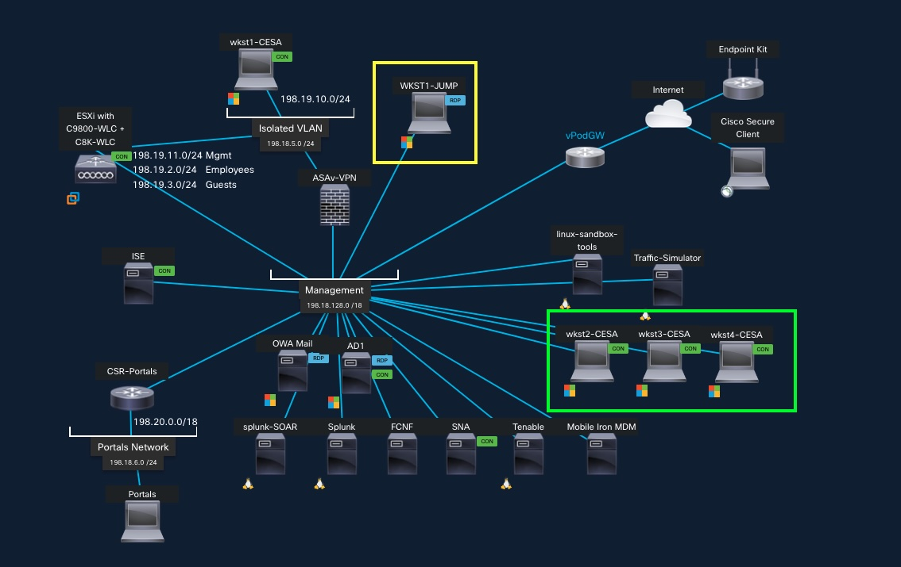

### Step 2. Open the demo launch portal

Browse to the Cisco ISE Enterprise and Security portal page.

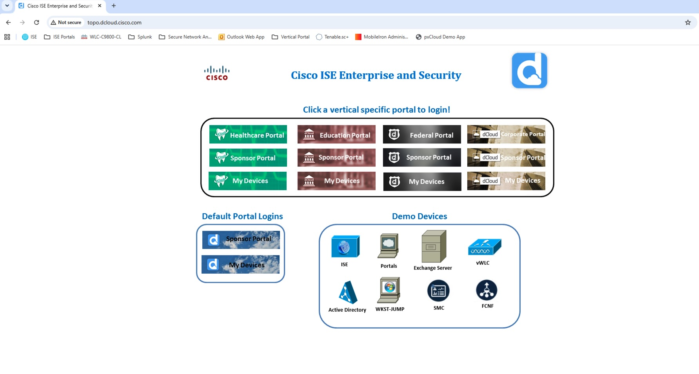

## Access Cisco ISE

### Step 3. Open the ISE admin login and accept the banner

When the ISE landing screen appears, click **Accept**.

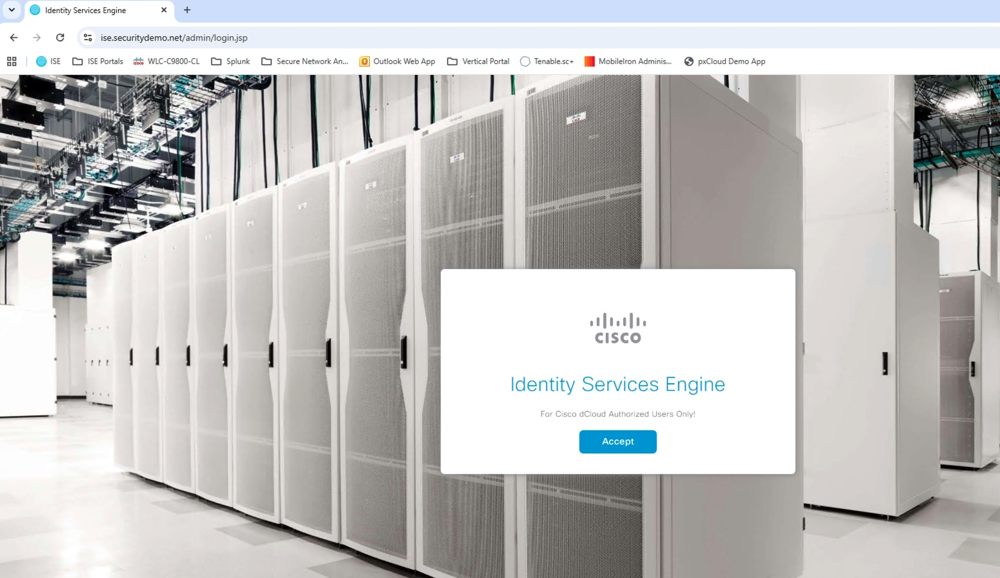

### Step 4. Sign in to ISE admin

Log in with admin credentials.

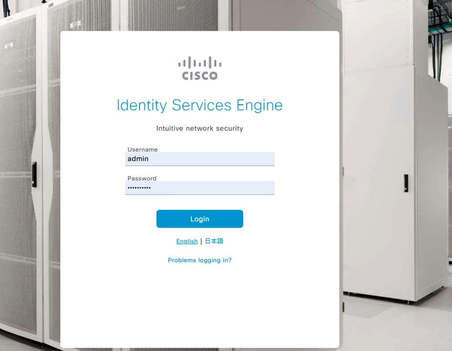

### Step 5. Confirm you are on the ISE dashboard

Verify ISE is up and processing endpoint activity.

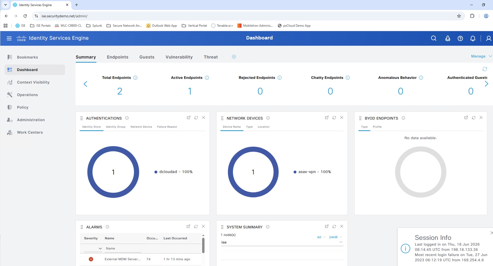

### Step 6. Verify policy set for remote access VPN

Navigate to **Policy > Policy Sets** and confirm the **Remote Access VPN** policy set is enabled and matching your VPN device conditions.

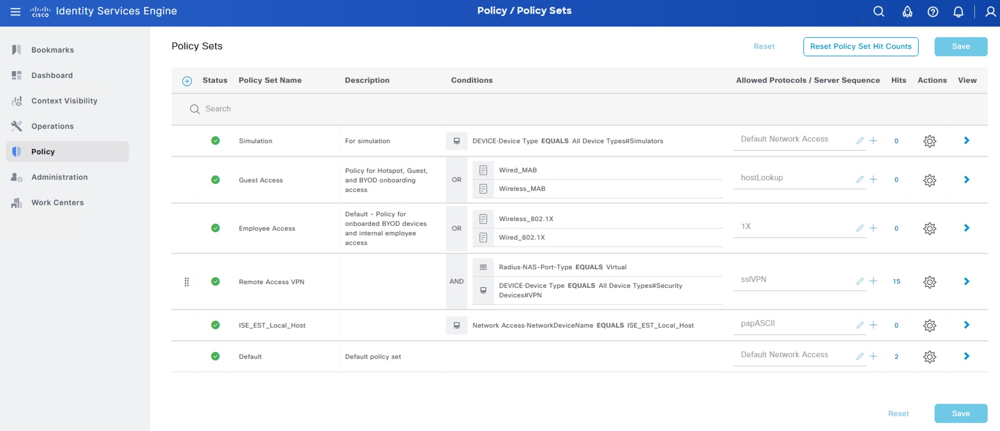

## Endpoint Validation - Employee Access

### Step 7. Start VPN from the endpoint

On endpoint `WKST4-CESA`, open Cisco Secure Client and connect to `198.18.133.100`.

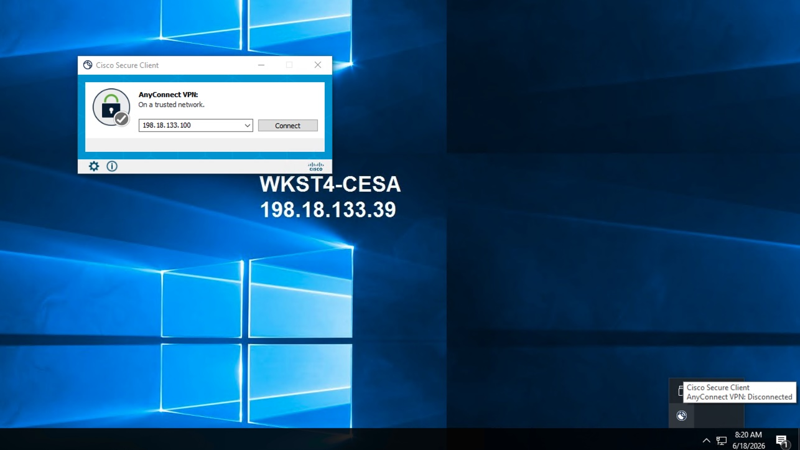

### Step 8. Accept certificate warning in demo environments

If prompted with an untrusted certificate warning, continue for the lab demo.

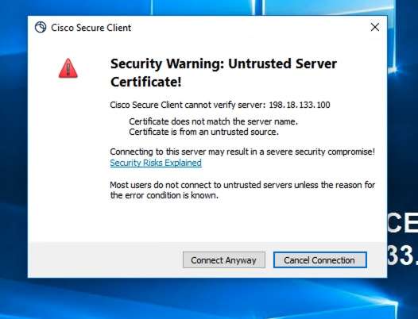

### Step 9. Authenticate as employee

Log in with the employee user account.

- **Username**: `employee`
- **Password**: `C1sco12345`

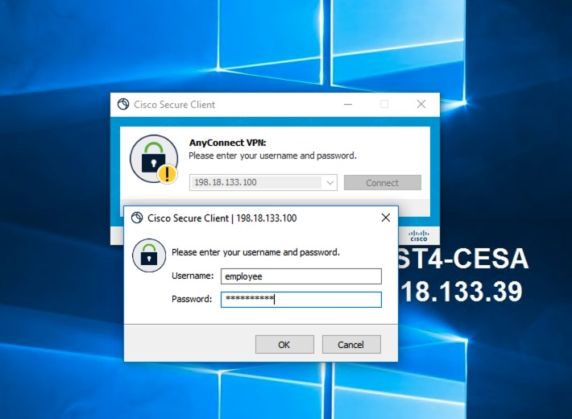

### Step 10. Confirm VPN is connected

Connection state should show connected.

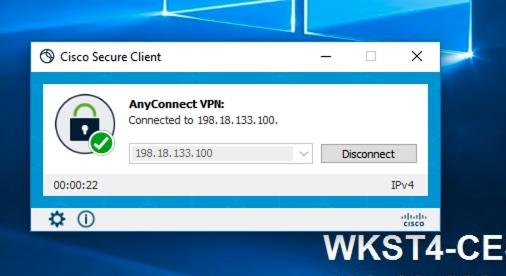

### Step 11. Open corporate portal and validate employee access

From the launch portal, open the Corporate Portal and then employee resources.

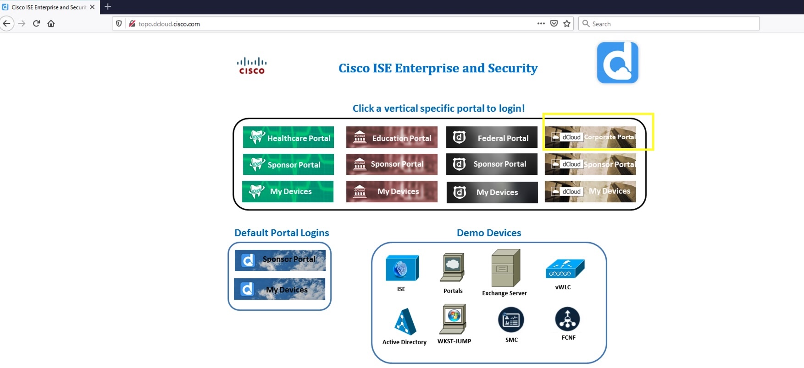

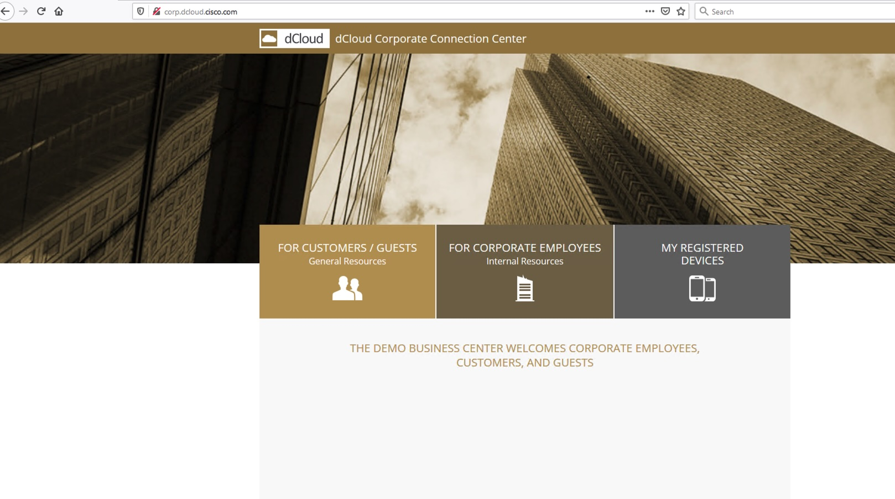

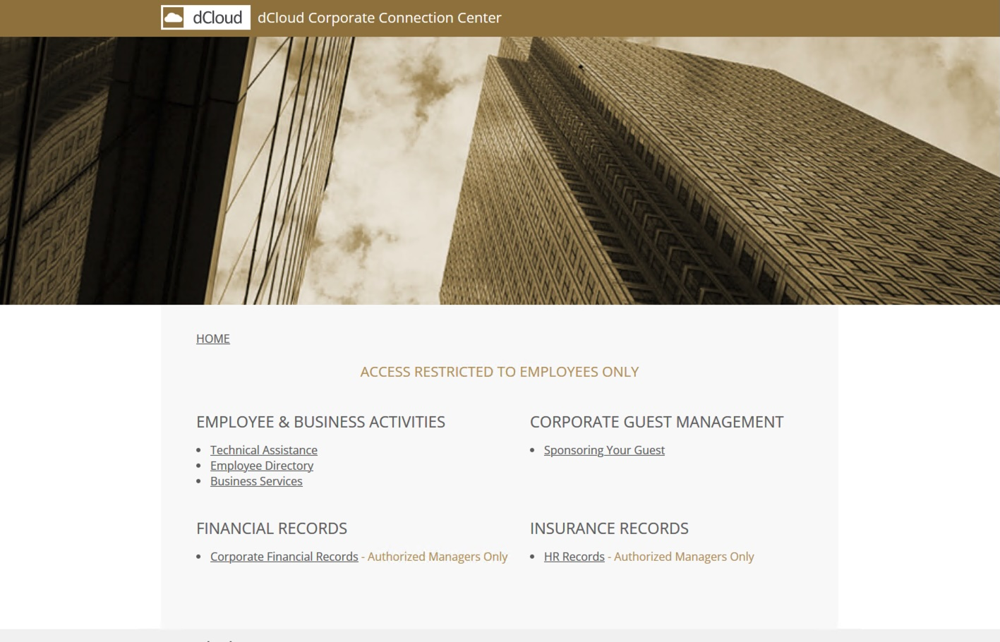

### Step 12. Attempt manager-only page as employee

Try to open the manager-only records page. As employee, access should fail or time out.

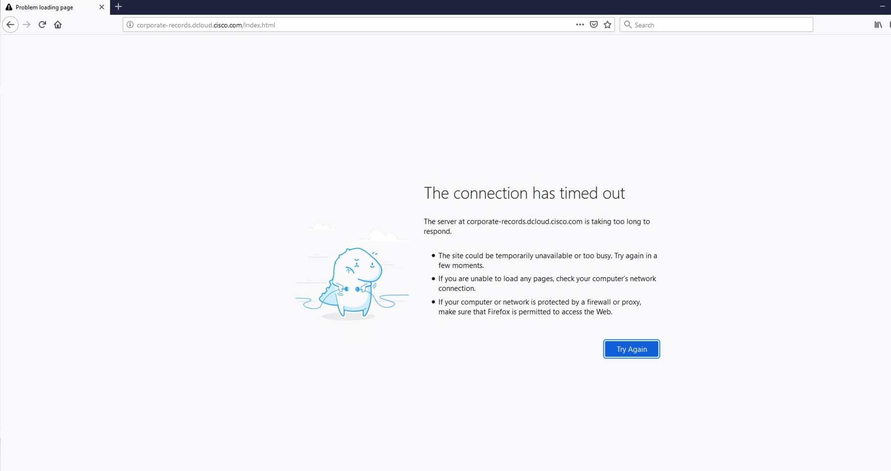

## Endpoint Validation - Manager Access

### Step 13. Re-authenticate VPN as manager

Disconnect/reconnect and sign in with a manager account.

- **Username**: `manager`
- **Password**: `C1sco12345`

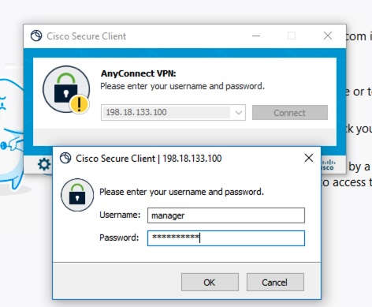

### Step 14. Validate manager-only page access

Open the same corporate records page. As manager, access should succeed.

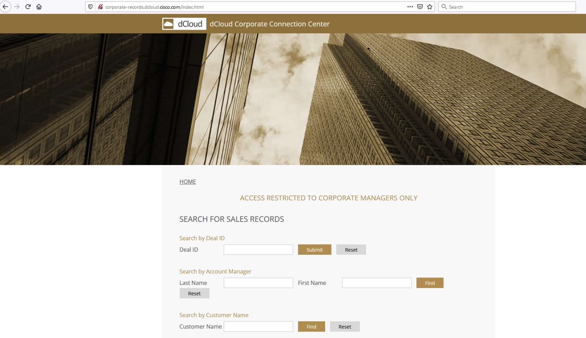

## Verify in ISE Live Logs

### Step 15. Confirm authorization outcomes

In ISE, open **Operations > RADIUS > Live Logs** and verify:

- `employee` session maps to `Remote Access VPN >> Tier2 Users`
- `manager` session maps to `Remote Access VPN >> Tier1 Users`

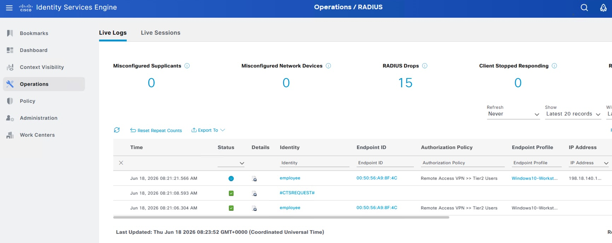

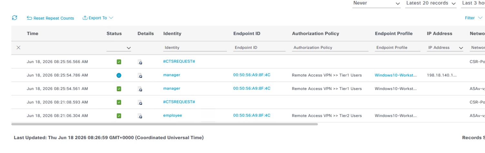

## Expected Outcome

At the end of this demo, you should have confirmed all of the following:

- VPN authentication is handled by Cisco ISE.
- Authorization changes by identity group/role.
- Employee access is restricted from manager-only resources.
- Manager access is permitted to restricted corporate records.
- Live Logs provide clear evidence of policy decisions.

## Notes

- This is a training/demo environment. Certificate and timeout behavior may vary by lab instance.
- If policy behavior does not match expected results, review the **Remote Access VPN** policy set, identity source sequence, and authorization rules.

---

[Next: ISE Endpoint Quarantine and Access Control →](index2.md)
