# ISE Endpoint Quarantine and Access Control

This guide demonstrates how to block a specific endpoint from network access using an ISE Endpoint Identity Group and a deny authorization policy — without changing user credentials.

[← Demo 1: ISE Policy and User Onboard](index.md)

## Table of Contents

- [Objective](#objective)
- [Create Endpoint Identity Group](#create-endpoint-identity-group)
- [Create Authorization Policy to Deny the Group](#create-authorization-policy-to-deny-the-group)
- [Add MAC Address to the Endpoint Group](#add-mac-address-to-the-endpoint-group)
- [Test User Connectivity](#test-user-connectivity)
- [Verify in ISE Live Logs](#verify-in-ise-live-logs)
- [Clean-Up](#clean-up)
- [Expected Outcome](#expected-outcome)
- [Notes](#notes)

## Objective

Show how ISE can enforce access control at the endpoint (device) level:

- A custom **QUARANTINE_ENDPOINT** group is created to hold blocked devices.
- An authorization rule is inserted that **denies** any endpoint in that group — regardless of user identity.
- A known MAC address is added to the group.
- The affected user is unable to connect via VPN.
- Removing the MAC address from the group restores access.

## Create Endpoint Identity Group

### Step 1. Navigate to Groups under Identity Management

Go to **Administration > Identity Management**, then click the **Groups** tab. Under **Identity Management** in the top navigation, select **Groups**.

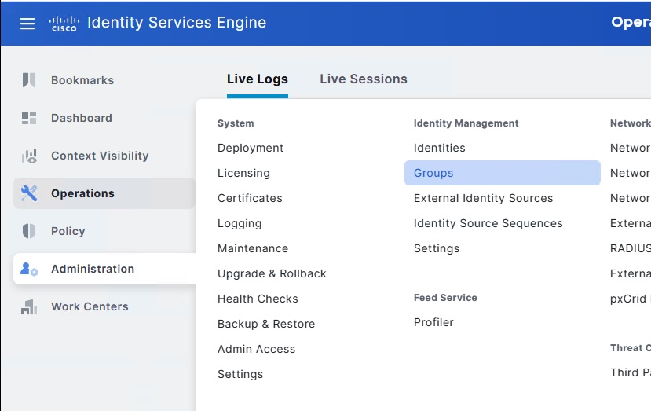

### Step 2. Create the QUARANTINE_ENDPOINT group

Expand **Endpoint Identity Groups** in the left panel and click the **New** button. Enter the name `QUARANTINE_ENDPOINT` and click **Submit**.

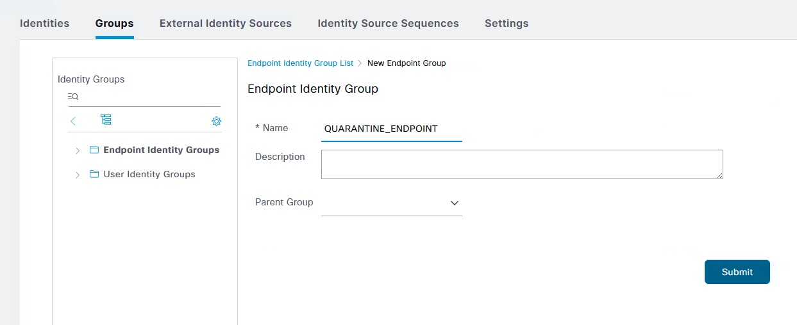

### Step 3. Confirm the group was created

The group list should now show **QUARANTINE_ENDPOINT** alongside the built-in groups (Blocked List, GuestEndpoints, Profiled, RegisteredDevices, Unknown).

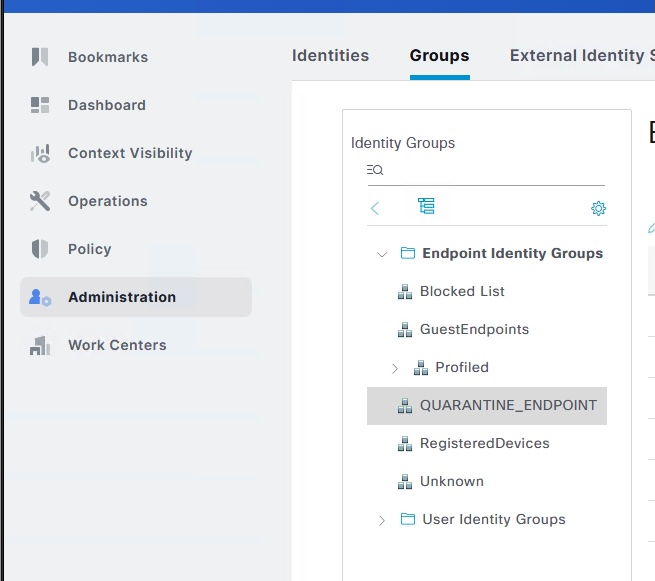

## Create Authorization Policy to Deny the Group

### Step 4. Open the Remote Access VPN policy set

Navigate to **Policy > Policy Sets** and open the **Remote Access VPN** policy set. Expand the **Authorization Policy** section to view the existing rules.

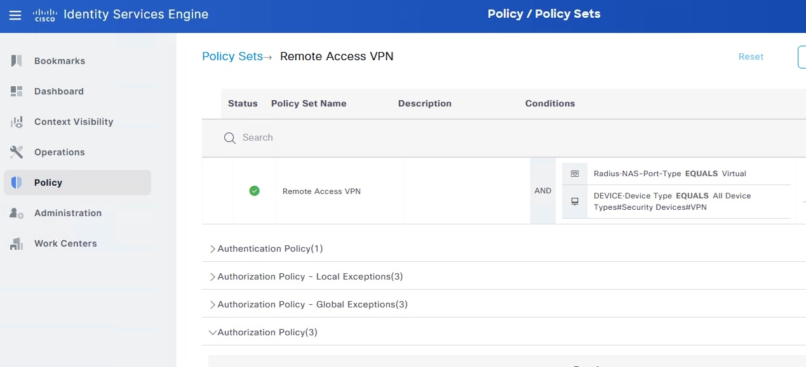

### Step 5. Insert a new rule above Tier1 Users

Click the gear icon on the **Tier1 Users** row and select **Insert new row above**. This places the new quarantine rule at the top so it is evaluated first.

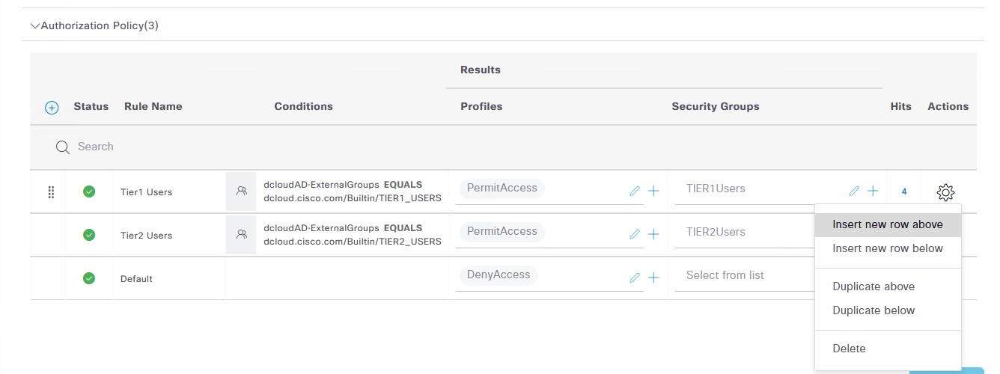

### Step 6. Name the new rule and open the Conditions editor

A blank row appears at the top. Name it `QUARANTINE`, then click the **+** in the Conditions column to open Conditions Studio.

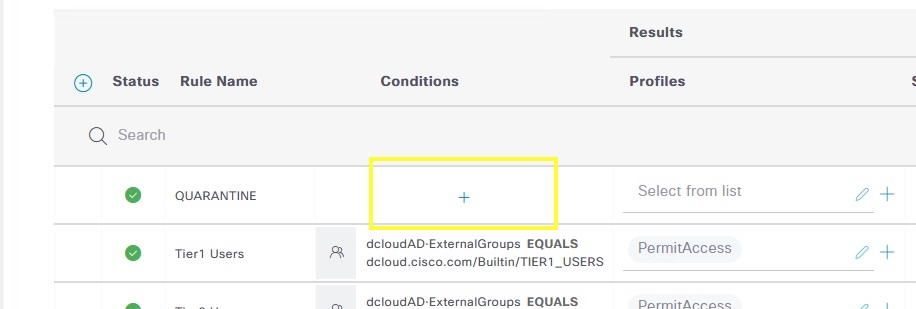

### Step 7. Select the IdentityGroup dictionary

In Conditions Studio, click **Click to add an attribute**. In the dictionary dropdown on the right, scroll down and select **IdentityGroup**.

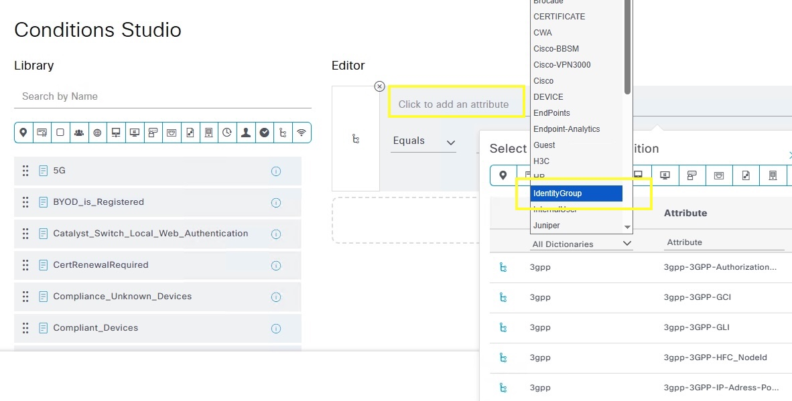

### Step 8. Select the Name attribute

In the **Select attribute for condition** dialog, filter by `IdentityGroup` dictionary and click **Name**.

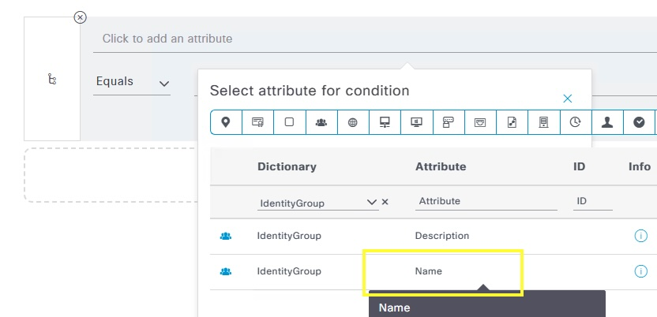

### Step 9. Set the value to QUARANTINE_ENDPOINT

In the Editor, the condition reads `IdentityGroup-Name`. In the value field, type `quaran` and select **Endpoint Identity Groups:QUARANTINE_ENDPOINT** from the suggestion list.

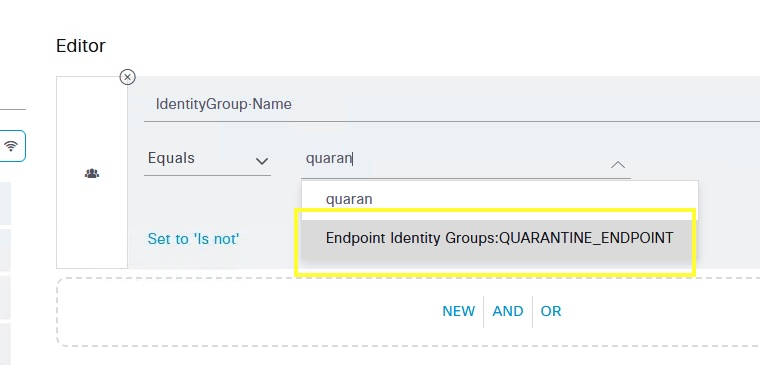

### Step 10. Confirm the condition and click Use

The final condition should read:
> `IdentityGroup-Name` **Equals** `Endpoint Identity Groups:QUARANTINE_ENDPOINT`

Click **Use** to apply the condition to the rule.

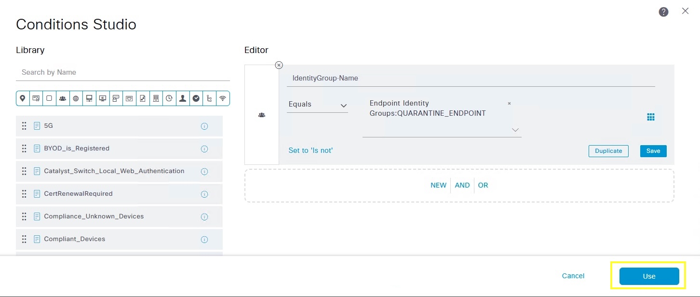

### Step 11. Set profile to DenyAccess and save

Back in the Authorization Policy, set the **Profiles** column for the QUARANTINE rule to **DenyAccess**. Click **Save** at the bottom right to commit the policy change.

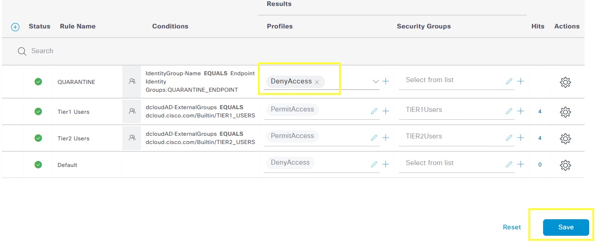

## Add MAC Address to the Endpoint Group

### Step 12. Open the QUARANTINE_ENDPOINT group and click Add

Return to **Administration > Identity Management > Groups**, open **QUARANTINE_ENDPOINT**, and click **+ Add** in the **Identity Group Endpoints** section.

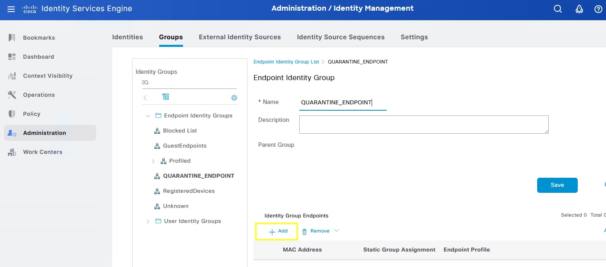

### Step 13. Select the endpoint MAC address

In the **Endpoints** picker, select the MAC address of the device to quarantine (`00:50:56:A9:8F:4C`) and confirm. Click **Save** on the group page.

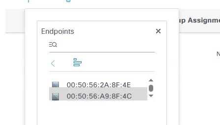

## Test User Connectivity

### Step 14. Attempt VPN connection as manager

On the endpoint, open Cisco Secure Client and connect to `198.18.133.100`. Authenticate with the **manager** account credentials.

- **Username**: `manager`
- **Password**: `C1sco12345`

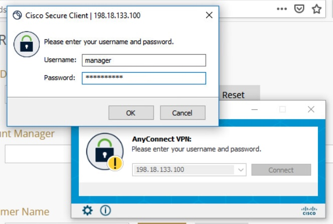

### Step 15. Confirm access is denied

The VPN client returns the error: **"You have no dial-in permission."** This confirms the QUARANTINE rule matched and access was denied — even though the user credentials are valid.

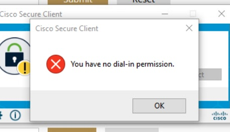

## Verify in ISE Live Logs

### Step 16. Review RADIUS Live Logs

In ISE, navigate to **Operations > RADIUS > Live Logs**. Confirm the latest `manager` session shows:

- **Status**: failed (red X)
- **Endpoint ID**: `00:50:56:A9:8F:4C`
- **Authorization Policy**: `Remote Access VPN >> QUARANTINE`

The earlier successful session (Tier1 Users, green check) is visible below it, confirming the policy change had immediate effect.

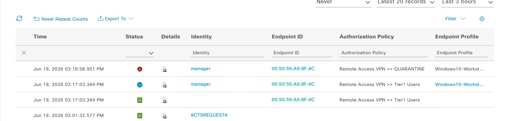

## Clean-Up

### Step 17. Remove the MAC address from the group

Return to **Administration > Identity Management > Groups > QUARANTINE_ENDPOINT**. Check the MAC address row, click **Remove**, then select **Remove Selected**.

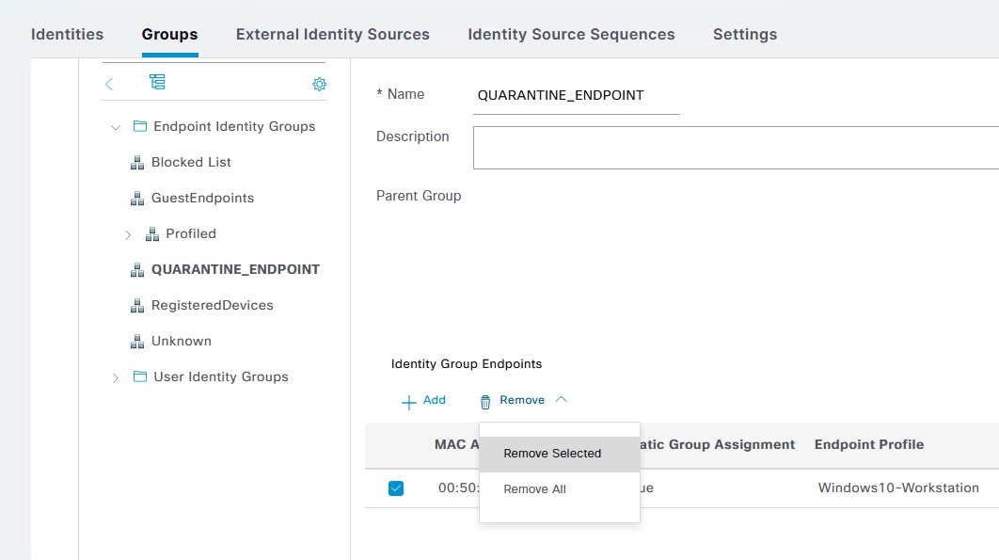

### Step 18. Confirm VPN access is restored

On the endpoint, reconnect via Cisco Secure Client. The **manager** account should now authenticate successfully and show **Connected to 198.18.133.100**.

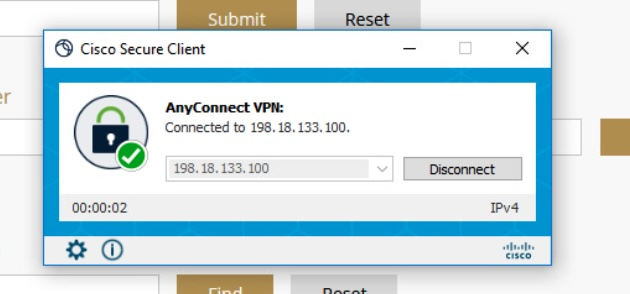

## Expected Outcome

By the end of this demo you should have confirmed:

- An Endpoint Identity Group can be used to quarantine specific devices by MAC address.
- An authorization rule with **DenyAccess** blocks the endpoint immediately, regardless of user role.
- Removing the MAC address from the group restores full access without any policy change.
- ISE Live Logs provide a clear per-session audit trail showing which rule was matched.

## Notes

- The QUARANTINE rule must be placed **above** role-based rules (Tier1/Tier2) so it is evaluated first.
- MAC address assignment to the group takes effect on the next authentication attempt — existing sessions are not interrupted.
- For production, consider automating quarantine assignment via ISE APIs or Cisco XDR integration instead of manual MAC entry.

---

[← Demo 1: ISE Policy and User Onboard](index.md)
