# ISE POV Testing with dACL

**Difficulty:** ★★★ Advanced

> **Scenario:** A customer wants to evaluate how ISE can apply differentiated access policies for a specific group of POV (Proof of Value) test users — without touching any of the production rules already in place. The goal is to create an isolated policy path: a dedicated AD group, a dedicated user, a permit-all downloadable ACL, and an authorization rule that sits above everything else. When the test is done, the entire rule can be removed cleanly. No existing policies are modified.

This guide walks through the full configuration end-to-end, and closes by verifying the dACL is pushed all the way down to the ASA firewall.

[← Demo 2: ISE Endpoint Quarantine and Access Control](index2.md)

## Table of Contents

- [Objective](#objective)
- [Access the AD Server](#access-the-ad-server)
- [Create POV_GROUP in Active Directory](#create-pov_group-in-active-directory)
- [Create povuser1 in Active Directory](#create-povuser1-in-active-directory)
- [Add povuser1 to POV_GROUP](#add-povuser1-to-pov_group)
- [Sync POV_GROUP to ISE](#sync-pov_group-to-ise)
- [Create Downloadable ACL](#create-downloadable-acl)
- [Create Authorization Profile](#create-authorization-profile)
- [Add Authorization Policy Rule](#add-authorization-policy-rule)
- [Test VPN Access as povuser1](#test-vpn-access-as-povuser1)
- [Verify in ISE Live Logs](#verify-in-ise-live-logs)
- [Verify on ASA Firewall](#verify-on-asa-firewall)
- [Expected Outcome](#expected-outcome)
- [Notes](#notes)

## Objective

Demonstrate how to stand up an isolated POV test policy in ISE:

- A new AD group (`POV_GROUP`) and user (`povuser1`) are created solely for testing.
- `POV_GROUP` is synced into ISE as an external identity group.
- A **Downloadable ACL** (`POV_dACL`) with `permit ip any any` is created to grant full access.
- An **Authorization Profile** (`POV_Authz`) references the dACL.
- A new **Authorization Policy rule** (`POV Rules`) is inserted at the top of the Remote Access VPN policy set, matching on `POV_GROUP` and returning `POV_Authz`.
- The production Tier1/Tier2 rules are untouched throughout.
- After testing, the dACL assignment is confirmed in ISE logs **and** on the ASA firewall session.

## Access the AD Server

### Step 1. RDP to the AD1 server

From the lab launch portal, locate the **AD1** node. Use **Web RDP** to connect.

- **IP Address**: `198.18.133.1`
- **Username**: `DCLOUD\Administrator`
- **Password**: `C1sco12345`

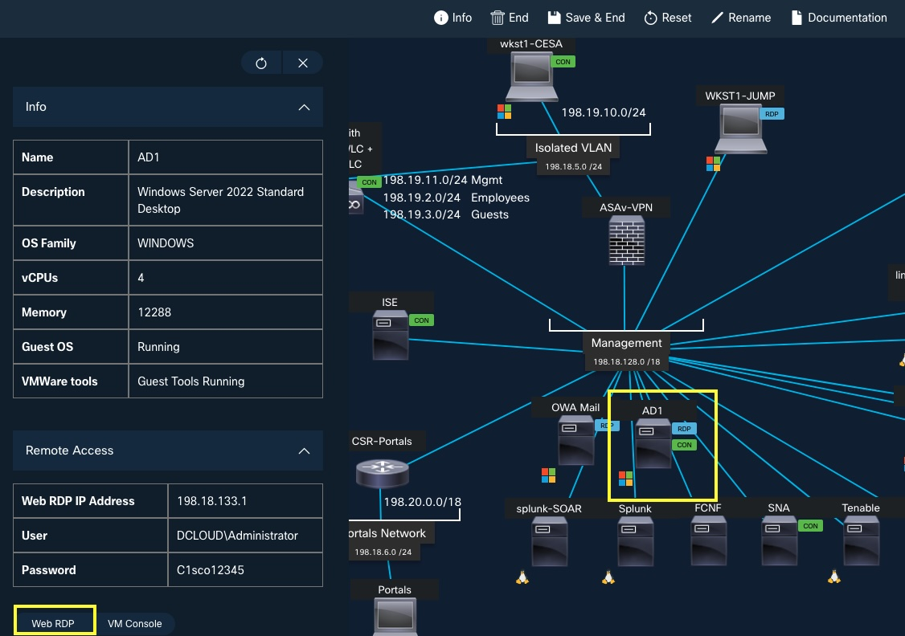

### Step 2. Open Active Directory Users and Computers

On the AD1 desktop, open the **Start Menu**, browse to **Windows Administrative Tools**, and click **Active Directory Users and Computers**.

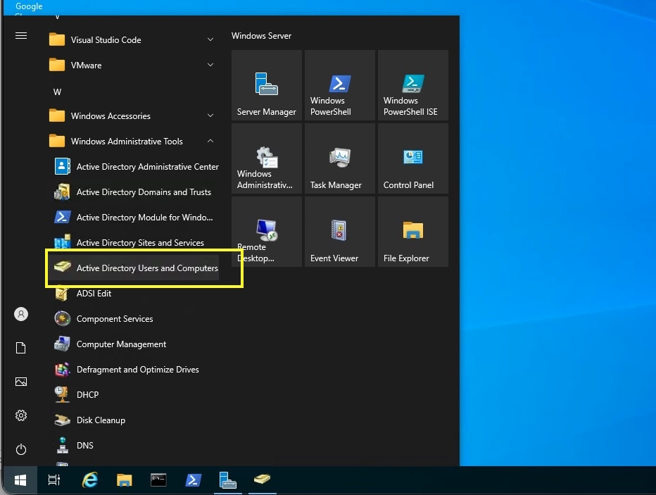

## Create POV_GROUP in Active Directory

### Step 3. Create a new group in the Builtin container

In the **Active Directory Users and Computers** tree, right-click the **Builtin** container, hover over **New**, and select **Group**.

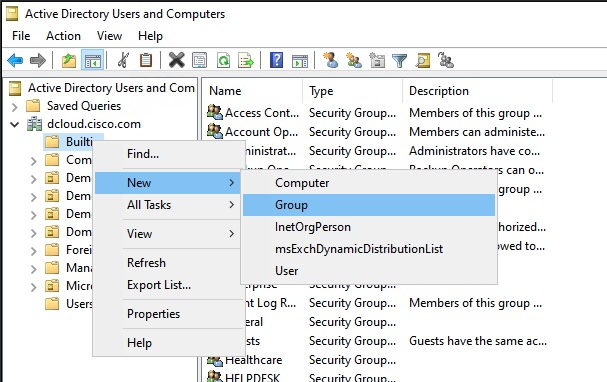

### Step 4. Name the group POV_GROUP

In the **New Object - Group** dialog:

- **Group name**: `POV_GROUP`
- **Group scope**: Global
- **Group type**: Security

Click **OK**.

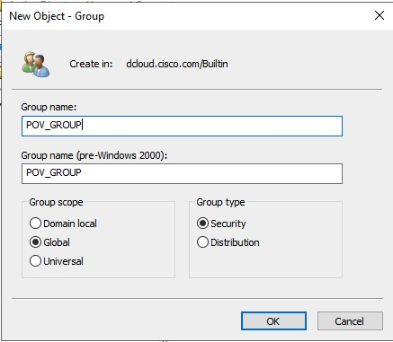

## Create povuser1 in Active Directory

### Step 5. Create a new user in the Demo Users OU

In the ADUC tree, expand the domain and right-click the **Demo Users** OU. Hover over **New** and select **User**.

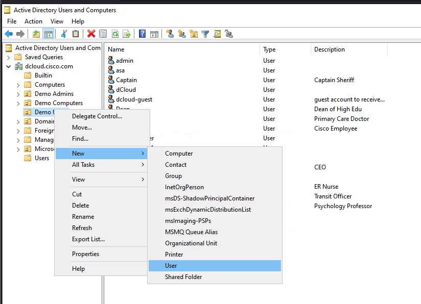

### Step 6. Enter the user details

In the **New Object - User** dialog:

- **First name**: `povuser1`
- **User logon name**: `povuser1` (domain: `@dcloud.cisco.com`)

Click **Next**.

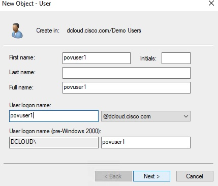

### Step 7. Set the password

Enter the password and configure the account options:

- **Password**: `C1sco12345`
- **Confirm password**: `C1sco12345`
- Check **Password never expires**

Click **Next**.

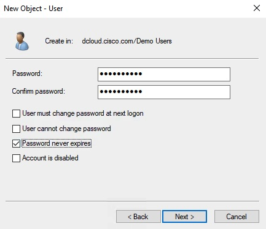

### Step 8. Finish creating the user

Review the summary — Full name: `povuser1`, logon: `povuser1@dcloud.cisco.com`. Click **Finish**.

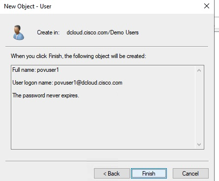

## Add povuser1 to POV_GROUP

### Step 9. Open povuser1's group membership

In the **Demo Users** OU, right-click **povuser1** and select **Add to a group...**.

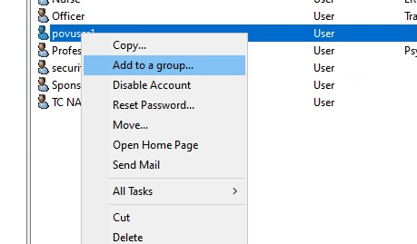

### Step 10. Select POV_GROUP

In the **Select Groups** dialog, type `POV_GROUP` in the object names field and click **OK**.

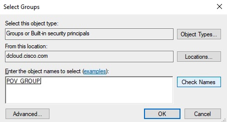

## Sync POV_GROUP to ISE

### Step 11. Navigate to External Identity Sources in ISE

In ISE, go to **Administration**, hover over **Identity Management**, and select **External Identity Sources**.

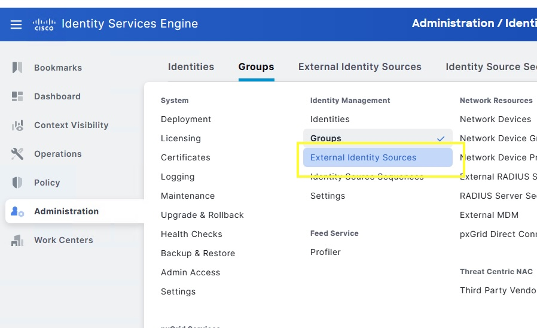

### Step 12. Open the dcloudAD Groups tab and select groups from directory

In the left panel, click **dcloudAD** under Active Directory. Select the **Groups** tab, then click **Add > Select Groups From Directory**.

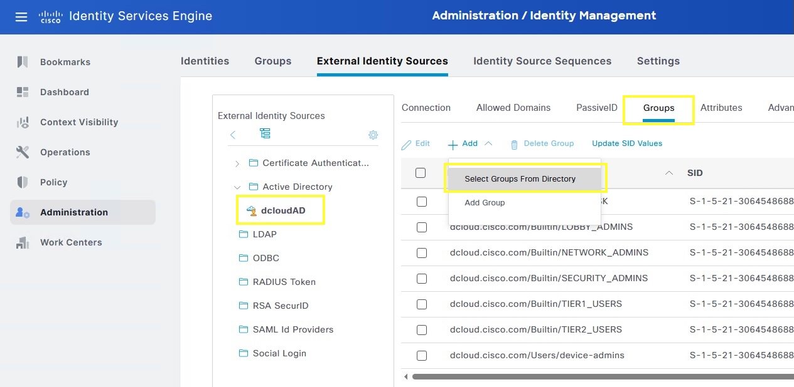

### Step 13. Retrieve and select POV_GROUP

In the **Select Directory Groups** dialog, click **Retrieve Groups** — 81 groups will load. Scroll to find and check **dcloud.cisco.com/Builtin/POV_GROUP**.

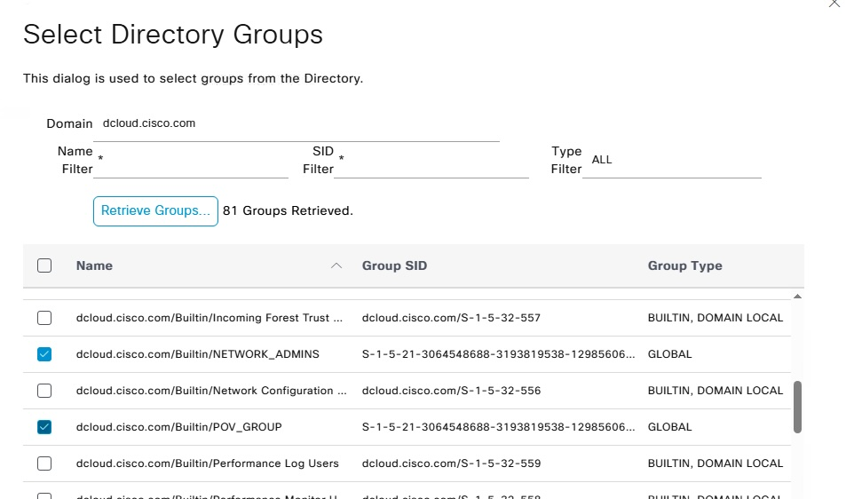

### Step 14. Confirm selection and click OK

Verify `dcloud.cisco.com/Builtin/POV_GROUP` is checked, then click **OK**.

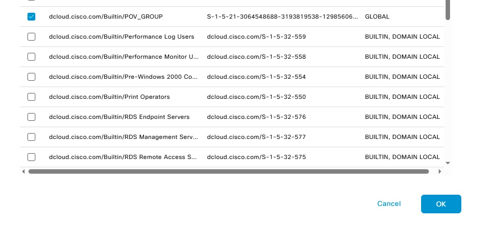

### Step 15. Save the group sync

Back on the Groups tab, confirm **POV_GROUP** now appears in the list alongside TIER1_USERS and TIER2_USERS. Click **Save**.

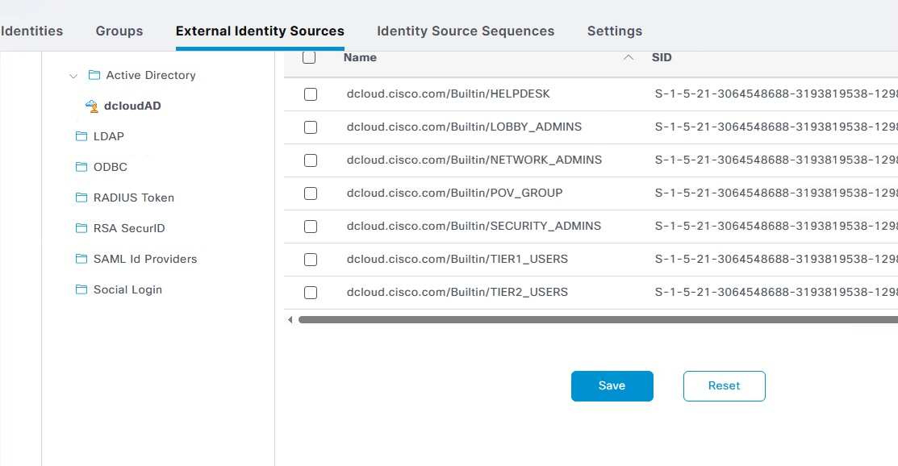

## Create Downloadable ACL

### Step 16. Navigate to Policy Elements > Results > Downloadable ACLs

In ISE, go to **Policy > Policy Elements > Results > Authorization > Downloadable ACLs**. Click **+ Add**.

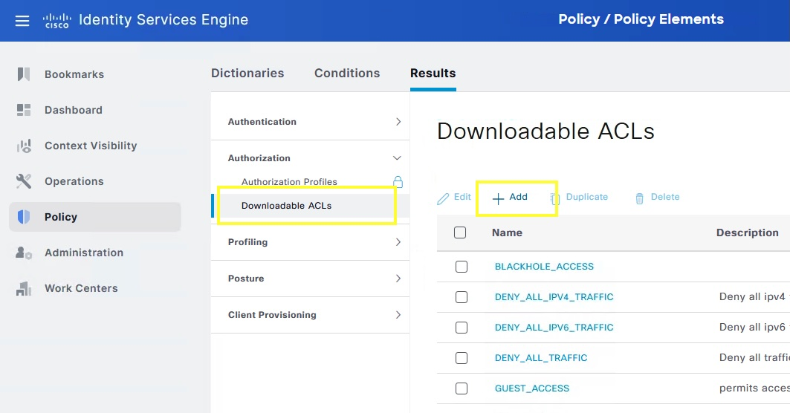

### Step 17. Create POV_dACL with permit rule

Fill in the new Downloadable ACL form:

- **Name**: `POV_dACL`
- **IP version**: IPv4
- **DACL Content**: `permit ip any any`

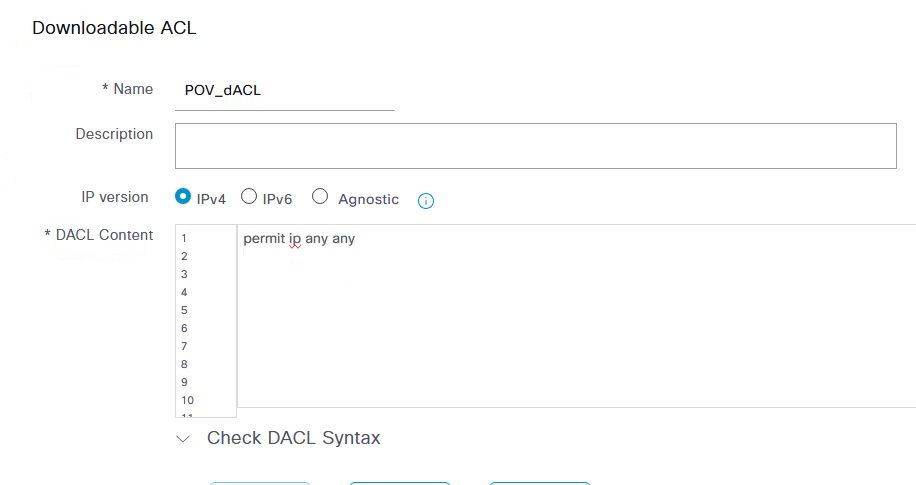

### Step 18. Check syntax and submit

Expand **Check DACL Syntax** to validate the rule, then click **Submit**.

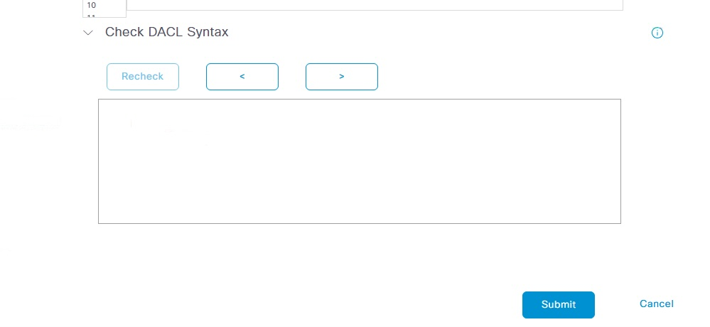

## Create Authorization Profile

### Step 19. Navigate to Authorization Profiles and click Add

Go to **Policy > Policy Elements > Results > Authorization > Authorization Profiles**. Click **+ Add**.

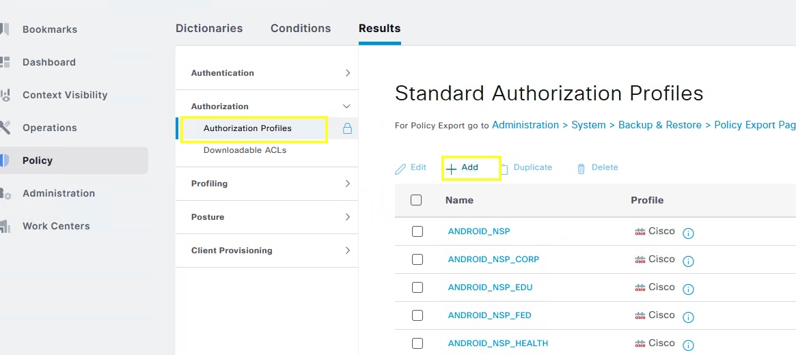

### Step 20. Name the profile POV_Authz

In the **New Authorization Profile** form:

- **Name**: `POV_Authz`
- **Access Type**: `ACCESS_ACCEPT`
- **Network Device Profile**: Cisco

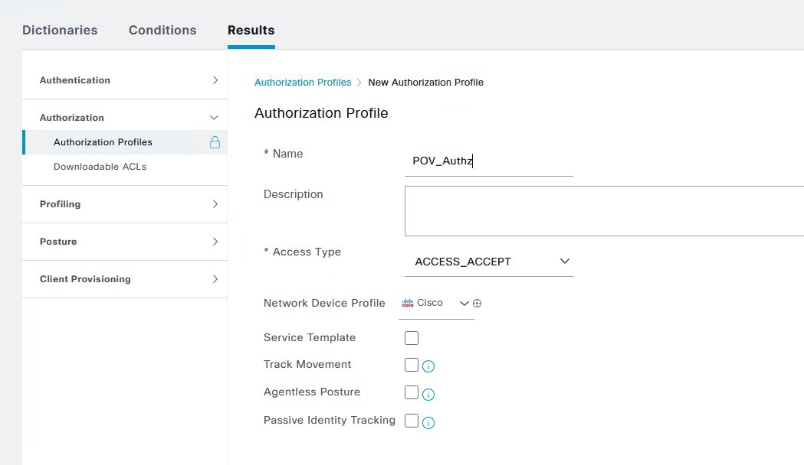

### Step 21. Assign the dACL under Common Tasks

Scroll down to **Common Tasks**. Check the **DACL Name** checkbox and select **POV_dACL** from the dropdown.

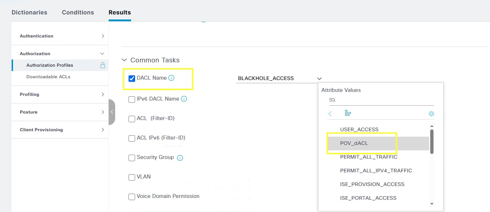

### Step 22. Confirm attributes and submit

The **Attributes Details** panel at the bottom should show:

```
Access Type = ACCESS_ACCEPT
DACL = POV_dACL
```

Click **Submit**.

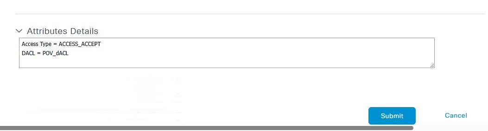

## Add Authorization Policy Rule

### Step 23. Open the Remote Access VPN policy set

Navigate to **Policy > Policy Sets** and open **Remote Access VPN**. Expand the **Authorization Policy** section — it currently has 4 rules (QUARANTINE, Tier1 Users, Tier2 Users, Default).

Click the gear icon on the **QUARANTINE** row and select **Insert new row above**.

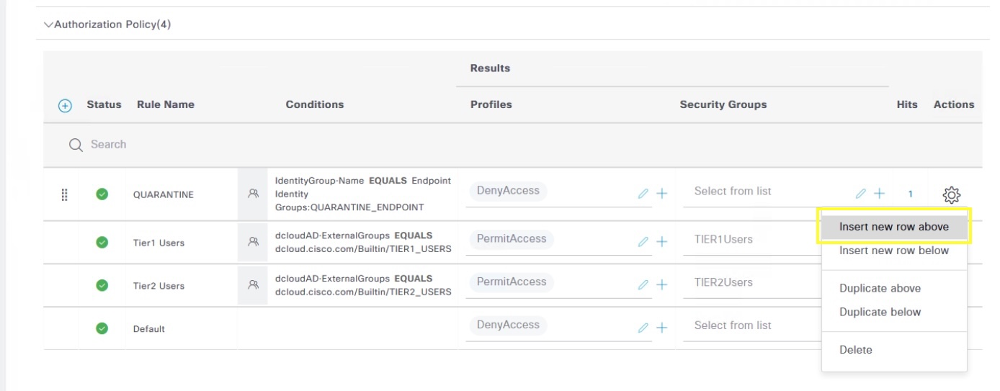

### Step 24. Name the new rule POV Rules and open Conditions

A blank row appears at the top. Name it `POV Rules`, then click the **+** in the Conditions column to open Conditions Studio.

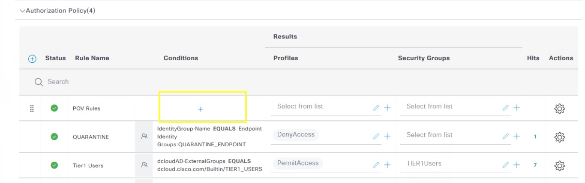

### Step 25. Select the dcloudAD dictionary

In Conditions Studio, click **Click to add an attribute**. In the dictionary dropdown, scroll down and select **dcloudAD**.

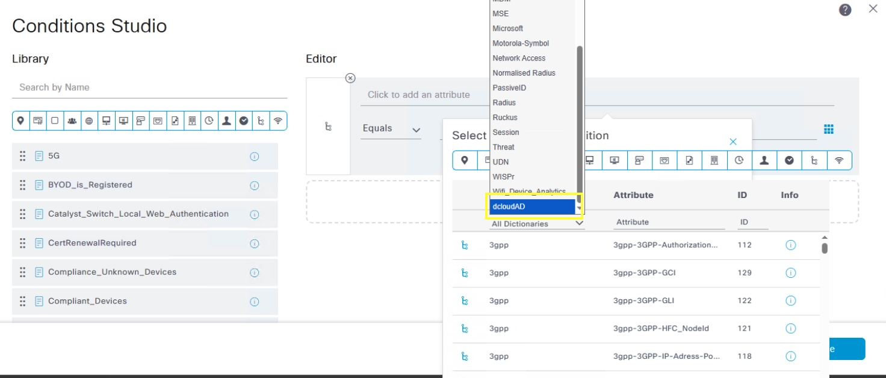

### Step 26. Select the ExternalGroups attribute

In the **Select attribute for condition** dialog, filter by `dcloudAD` and click **ExternalGroups**.

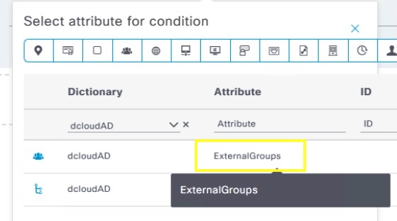

### Step 27. Set value to POV_GROUP and click Use

In the Editor, the condition reads `dcloudAD-ExternalGroups`. In the value dropdown, select **dcloud.cisco.com/Builtin/POV_GROUP**. Click **Use**.

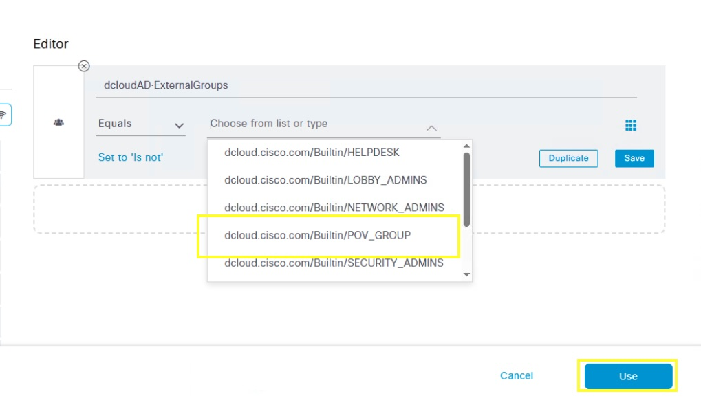

### Step 28. Assign POV_Authz profile and save

Back in the Authorization Policy, for the **POV Rules** row open the **Profiles** dropdown and select **POV_Authz**. Click **Save**.

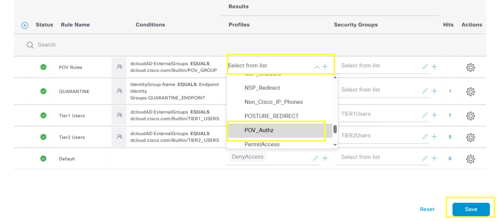

## Test VPN Access as povuser1

### Step 29. Connect VPN as povuser1 from CESA4

On workstation **CESA4**, open **Cisco Secure Client** and connect to `198.18.133.100`. Authenticate with the POV user credentials:

- **Username**: `povuser1`
- **Password**: `C1sco12345`

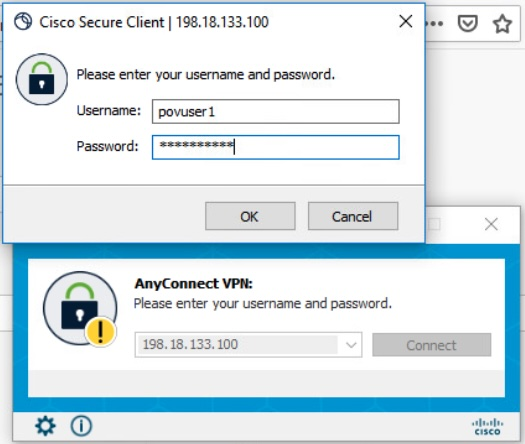

### Step 30. Access the corporate portal

Once connected, open a browser and navigate to the **dCloud Corporate Connection Center** at `corporate-records.dcloud.cisco.com`. The page should load successfully, confirming the permit-all dACL is in effect.

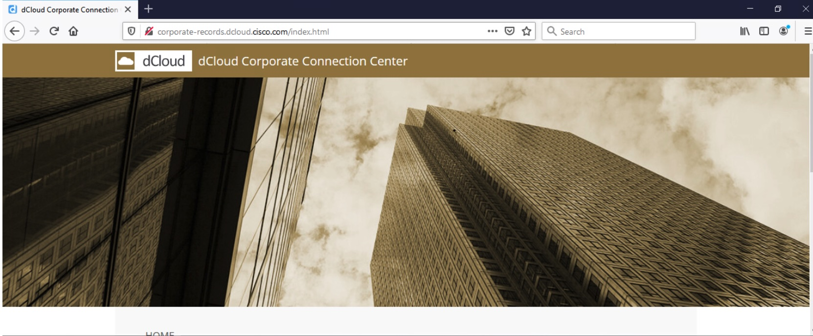

## Verify in ISE Live Logs

### Step 31. Check RADIUS Live Logs for povuser1

In ISE, navigate to **Operations > RADIUS > Live Logs**. Confirm the `povuser1` session shows:

- **Authorization Policy**: `Remote Access VPN >> POV Rules`
- **Endpoint ID**: `00:50:56:A9:8F:4C`

Click the **Details** icon on the session row to open the Authentication detail report.

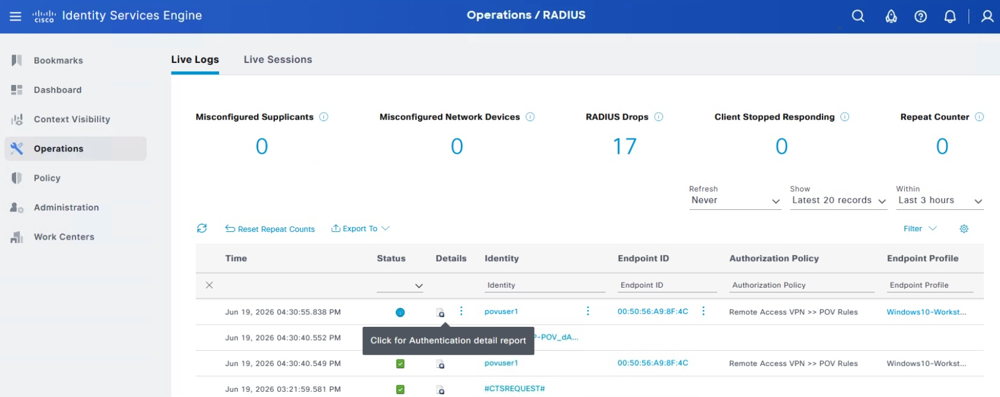

### Step 32. Confirm authorization result in the detail report

In the **Overview** section of the detail report, verify:

- **Event**: `5200 Authentication succeeded`
- **Username**: `povuser1`
- **Authorization Policy**: `Remote Access VPN >> POV Rules`
- **Authorization Result**: `POV_Authz`

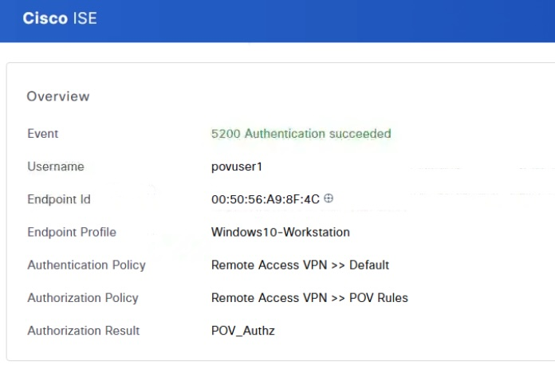

### Step 33. Confirm dACL is returned in the RADIUS result

Scroll down to the **Result** section of the detail report. Confirm the `cisco-av-pair` attribute shows the dACL name pushed to the ASA:

```
ACS:CiscoSecure-Defined-ACL=#ACSACL#-IP-POV_dACL-6a356c17
```

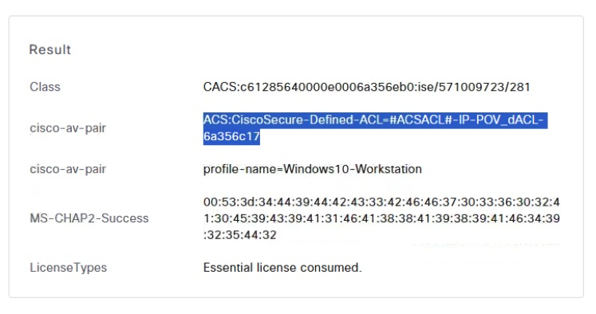

## Verify on ASA Firewall

### Step 34. SSH to ASAv-vpn using PuTTY

From the workstation taskbar, open **PuTTY**. In the **Saved Sessions** list, select **ASAv-vpn** and click **Open**. When prompted, log in with the ASA credentials:

- **Username**: `admin`
- **Password**: `C1sco12345`

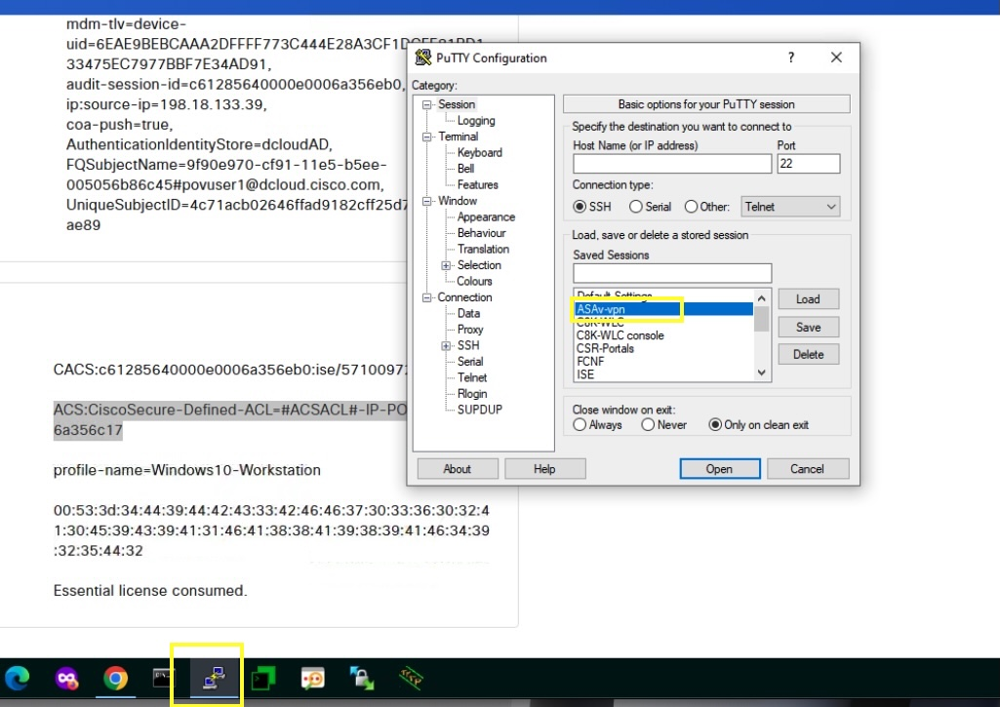

### Step 35. Run show vpn-sessiondb detail anyconnect

At the ASA CLI prompt, run:

```
show vpn-sessiondb detail anyconnect
```

Locate the `povuser1` session entry. Scroll to the **DTLS-Tunnel** section and confirm the **Filter Name** field shows the dACL assigned by ISE.

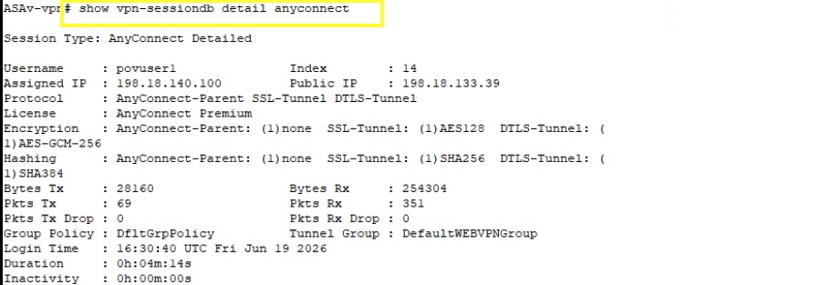

### Step 36. Confirm the Filter Name on the tunnel

In the **DTLS-Tunnel** section of the session output, verify:

```
Filter Name : #ACSACL#-IP-POV_dACL-6a356c17
```

This confirms ISE pushed the dACL and the ASA applied it to the VPN tunnel.

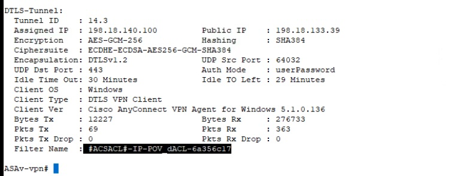

### Step 37. Check the ACL hit count

Run the following command to verify the dACL is active and has been matched by traffic:

```
show access-list | in POV
```

The output should show the dynamically installed ACL and a non-zero `hitcnt`:

```
access-list #ACSACL#-IP-POV_dACL-6a356c17; 1 elements; name hash: 0xef00751d (dynamic)
access-list #ACSACL#-IP-POV_dACL-6a356c17 line 1 extended permit ip any4 any4 (hitcnt=70)
```

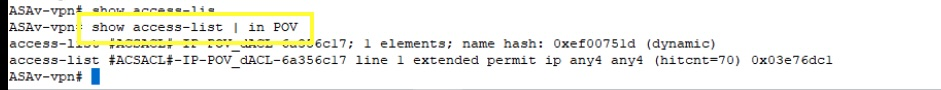

## Expected Outcome

By the end of this demo you should have confirmed:

- A new AD group (`POV_GROUP`) and user (`povuser1`) were created without modifying any existing AD objects.
- ISE synced `POV_GROUP` from Active Directory and made it available as a policy condition.
- A `permit ip any any` dACL (`POV_dACL`) was created and wrapped in an Authorization Profile (`POV_Authz`).
- A new policy rule (`POV Rules`) was inserted at the top of the Remote Access VPN authorization policy — above the production QUARANTINE and Tier1/Tier2 rules — and matches only members of `POV_GROUP`.
- `povuser1` authenticated successfully via VPN and reached the corporate portal.
- ISE Live Logs confirm the correct policy and dACL were applied.
- The ASA VPN session for `povuser1` shows the dACL as the Filter Name, with live hit counts proving traffic is being matched.

## Notes

- The `POV Rules` rule is evaluated first. Any user in `POV_GROUP` will receive `POV_Authz` regardless of AD role — keep this in mind when adding users to the group.
- The dACL is dynamically installed on the ASA per-session; it is removed automatically when the VPN session ends.
- For cleanup: disable or delete the `POV Rules` authorization rule and remove `povuser1` from `POV_GROUP`. The dACL and Authorization Profile can remain for future POV sessions.
- The `show access-list | in POV` filter is a quick way to check live hit counts without scrolling through the full ACL table.

---

[← Demo 2: ISE Endpoint Quarantine and Access Control](index2.md)
