<script src="enrollment-gate.js" defer></script>

# ISE VPN Posture — Monitor Mode

**Difficulty:** ★★★ Advanced

> **Scenario:** The security team wants visibility into endpoint compliance on the VPN — but is not ready to block anyone yet. By deploying posture in Monitor Mode, every VPN session is assessed and results are logged, while users experience zero disruption. Administrators use the data to identify non-compliant endpoints, prepare remediation guidance, and validate the policy before enforcement begins.

This guide covers the complete posture infrastructure setup and the monitor-mode deployment. Enforcement is covered in [Demo 5](index5.md).

[← Demo 3: ISE POV Testing with dACL](index3.md)

## Table of Contents

- [Objective](#objective)
- [Verify Posture Services](#verify-posture-services)
- [Configure Client Provisioning](#configure-client-provisioning)
- [Create Posture Condition](#create-posture-condition)
- [Create Posture Requirement](#create-posture-requirement)
- [Create Posture Policy](#create-posture-policy)
- [Create Posture Authorization Profiles](#create-posture-authorization-profiles)
- [Add Posture Rules to Authorization Policy](#add-posture-rules-to-authorization-policy)
- [Test: Simulate Non-Compliant Endpoint](#test-simulate-non-compliant-endpoint)
- [Verify Posture Status in ISE Logs](#verify-posture-status-in-ise-logs)
- [Review Posture Policy Details](#review-posture-policy-details)
- [Expected Outcome](#expected-outcome)
- [Notes](#notes)

## Objective

Stand up ISE posture for VPN users with zero user impact:

- A **Windows Defender Firewall** check is used as the posture condition — easy to toggle on/off to produce both compliant and non-compliant states during testing.
- Three authorization rules are added for posture states: **Unknown** (agent initializing), **NonCompliant** (failed check), and **Compliant** (passed).
- In Monitor Mode, non-compliant users receive full access — the same as compliant users. The only difference is which authorization profile name appears in the logs.
- Administrators use **RADIUS Live Logs** and the **Posture Assessment by Endpoint** report to identify violations and build a remediation plan before any enforcement begins.

## Verify Posture Services

### Step 1. Confirm ISE Plus license is active

Navigate to **Administration > System > Licensing**. Verify the **ISE Plus** or **ISE Advantage** license tier is shown as **Active** — posture assessment requires this tier.

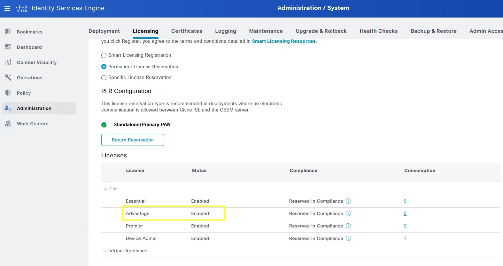

### Step 2. Verify Posture persona is enabled on the ISE node

Navigate to **Administration > System > Deployment**. Click the ISE node hostname. In the **General Settings** tab, confirm **Policy Service** is toggled on and **Enable Session Services** is checked. There is no separate "Enable Posture Service" checkbox — Posture is included automatically when Session Services is enabled.

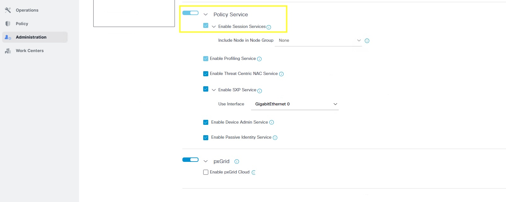

## Configure Client Provisioning

When a VPN user connects for the first time, their session enters the `PostureStatus = Unknown` state. ISE redirects their browser to the **Client Provisioning Portal (CPP)**. The portal checks whether the Cisco Secure Client ISE Compliance module is installed. If it is missing, the portal serves the installer automatically. Once installed, the compliance module runs the posture check and reports back to ISE.

This section sets up the resources and policy ISE needs to deliver the compliance module to endpoints that already have Cisco Secure Client but are missing the posture component.

> **End user experience during provisioning:**
> 1. User connects VPN → browser opens and is redirected to the ISE Client Provisioning Portal
> 2. The portal detects Cisco Secure Client is installed but the compliance module is missing
> 3. The user clicks **Start** or **Download** on the portal page
> 4. The compliance module installs as an add-on to the existing Cisco Secure Client installation — no full reinstall required
> 5. Once installed, the module contacts ISE automatically and runs the posture assessment
> 6. ISE sends a CoA to the ASA — the session transitions from Unknown to Compliant or NonCompliant

### Step 3. Navigate to Client Provisioning and check Resources

Go to **Work Centers > Posture > Client Provisioning**. The page is divided into two areas: **Policy** rules at the top and **Resources** at the bottom. Resources are the packages and configurations ISE serves to endpoints from the portal.

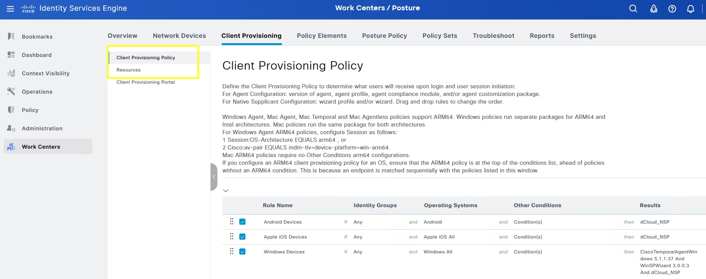

### Step 4. Verify the ISE Compliance Module is available in Resources

In the **Resources** section, look for an entry of type **AnyConnect ISE Compliance Module** (ISE 2.x) or **Cisco Secure Client ISE Compliance Module** (ISE 3.x+). The filename follows the pattern:

```
cisco-secure-client-win-<version>-isecompliance-webdeploy-k9.pkg
```

If the module is not listed, add it using one of two methods:

- **From Cisco.com** (if ISE has internet access): click **Add > Agent resources from Cisco site**, search for `Compliance`, latest version, and download directly into ISE.
- **From local disk**: download the `.pkg` file from cisco.com/go/secure-client to your workstation first, then click **Add > Agent resources from local disk** and upload it.


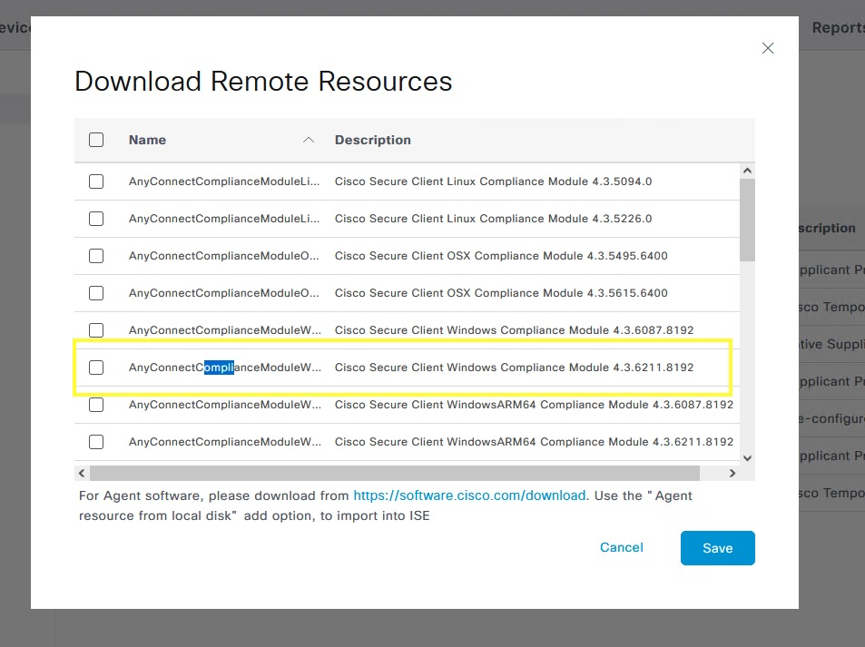

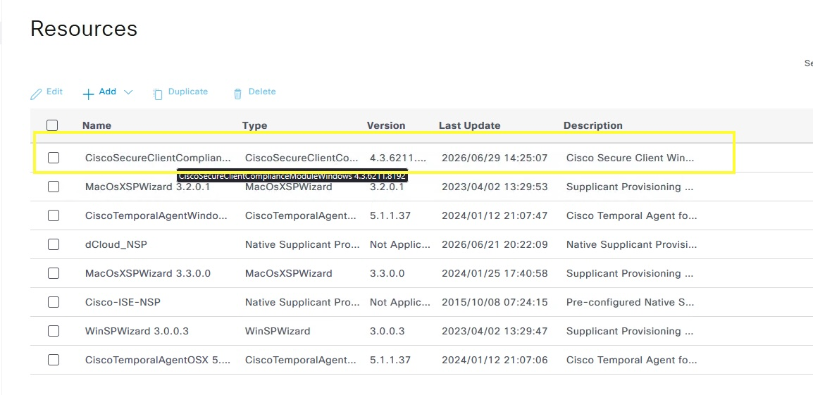

### Step 5a. Upload the Cisco Secure Client package from local disk

The Cisco Secure Client `.pkg` file must be loaded into ISE Resources before it can be referenced by the Agent Configuration. Locate the file on the admin workstation — it follows the naming pattern:

```
cisco-secure-client-win-<version>-webdeploy-k9.pkg
```

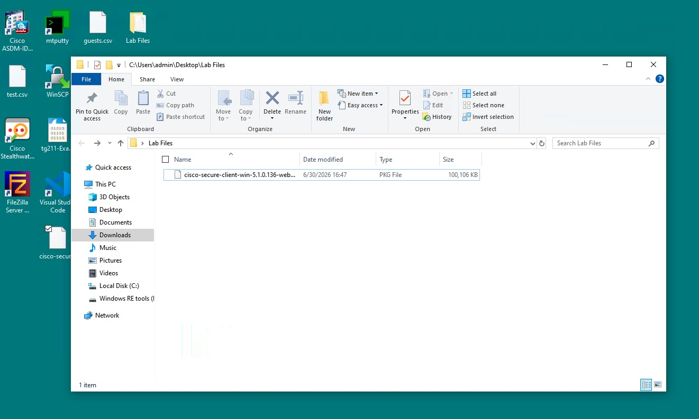

In the **Resources** section, click **Add > Agent resources from local disk**. Set **Category** to **Cisco Provided Packages**. Click **Browse**, select the `.pkg` file, and click **Open**. Click **Submit**.

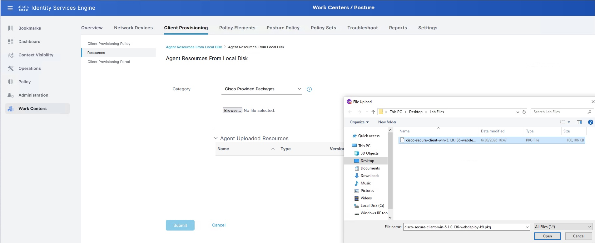

### Step 5b. Create the ISE Posture Agent Profile

The posture agent profile controls how the compliance module behaves after installation — retry timers, stealth mode, and the ISE server discovery rules. ISE will not let you save an Agent Configuration without a posture profile assigned.

In the **Resources** section, click **Add > ISE Posture Agent Profile**. Fill in:

- **Name**: `SC_Win_Posture_Profile`
- Leave all **Agent Behavior** settings at their defaults

Scroll down to the **Server name rules** field (required) and enter `*`.

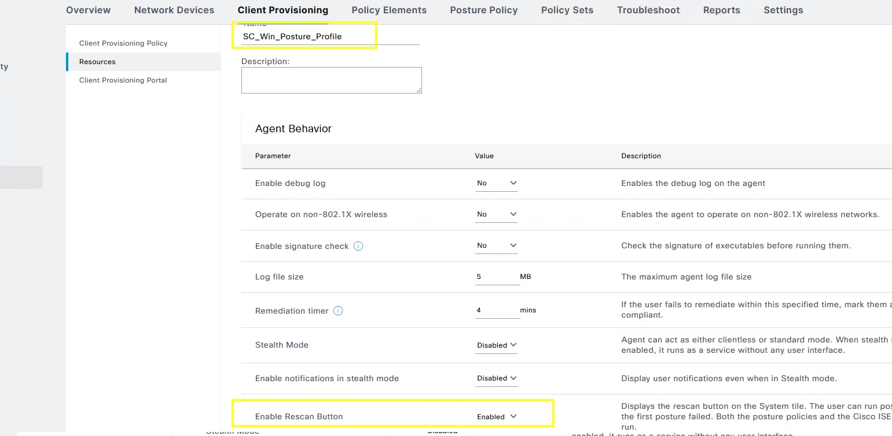

> **Server name rules** is a wildcard-comma-separated list of ISE hostnames the agent is permitted to connect to. Using `*` allows any ISE node — appropriate for a single-node lab. In production, restrict this to your ISE FQDNs (e.g., `*.cisco.local`).

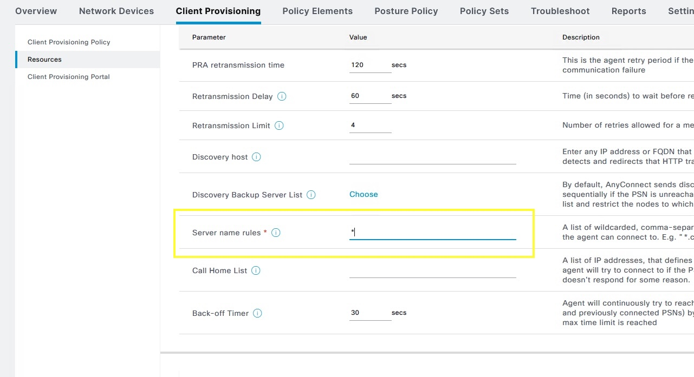

Click **Submit**.

### Step 5c. Create the Agent Configuration

The Agent Configuration bundles everything the Client Provisioning Portal needs to deliver to the endpoint: the Secure Client package, the compliance module, which SC modules to enable, and which posture agent profile to apply.

In the **Resources** section, click **Add > Agent Configuration**. Fill in:

- **Select Agent Package**: `CiscoSecureClientDesktopWindows 5.1` (uploaded in Step 5a)
- **Configuration Name**: `SC_Win_Posture_Config`
- **Compliance Module**: select the ISE Compliance module (uploaded in Step 4)
- Under **Cisco Secure Client Module Selection**: check **ISE Posture** and **VPN**; leave all others unchecked

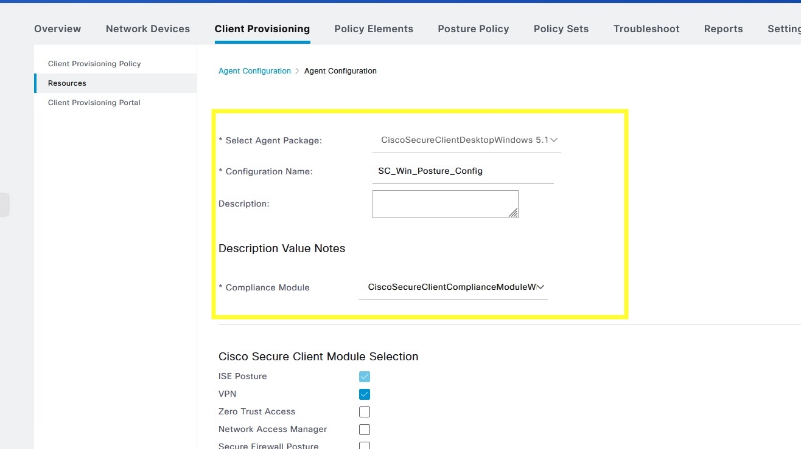

Scroll down to the **Profile Selection** section. For **ISE Posture**, select `SC_Win_Posture_Profile` (created in Step 5b). Leave all other module profile dropdowns empty.

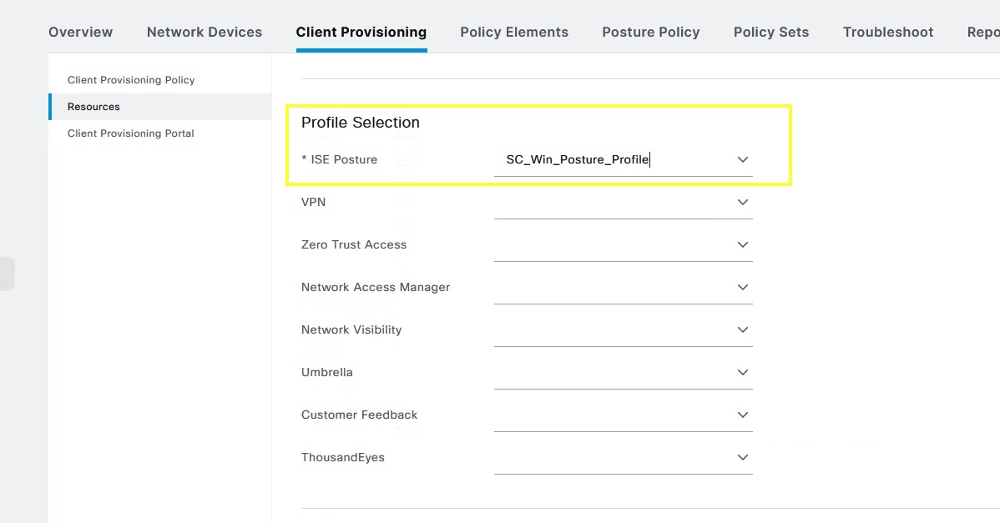

Click **Submit**.

> This configuration is what the Client Provisioning Portal page references when a Windows endpoint connects. It tells the portal which Secure Client package and compliance module to offer, and delivers the posture agent profile so the module knows how to reach ISE and report results after installation.

### Step 6. Create the Client Provisioning Policy rule

Navigate to **Work Centers > Posture > Client Provisioning > Client Provisioning Policy** (or **Policy > Client Provisioning**). The policy table lists existing rules — you will see default entries such as **Android Devices**, **Apple iOS Devices**, and **Windows Devices**.

There is no standalone **Add Rule** button. To insert a new rule, click the **Edit ∨** dropdown arrow on the existing **Windows Devices** row and select **Insert new rule above**. A blank row appears above it.

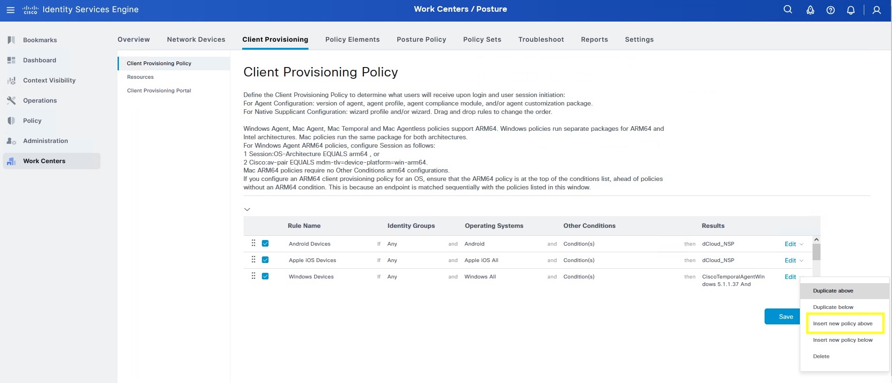

Configure the new row:

- **Rule Name**: `Windows_Posture_Provision`
- **Operating System**: Windows All
- **Results**: click **+** and select `SC_Win_Posture_Config` (created in Step 5c)

Click **Done** on the row, then click **Save** at the bottom of the page.

> ISE evaluates rules top-down and stops at the first match. Placing `Windows_Posture_Provision` **above** the existing Windows Devices rule ensures VPN endpoints get the Secure Client persistent agent config rather than any temporal/agentless config already present.

## Create Posture Condition

Posture conditions define exactly what ISE checks on the endpoint.

### Step 7. Navigate to Firewall Conditions

Go to **Policy > Policy Elements > Conditions > Posture > Firewall Condition**. Click **+ Add**.

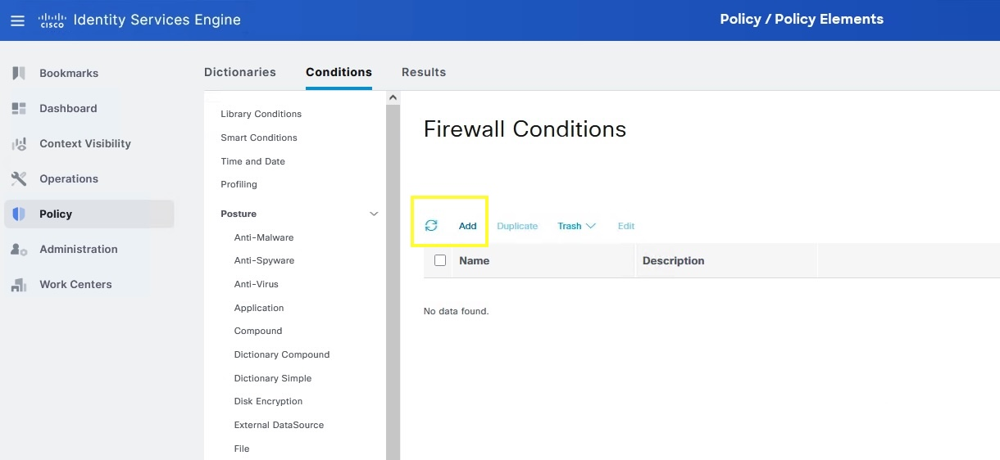

### Step 8. Create the Win_Firewall_Enabled condition

Fill in the **New Firewall Condition** form:

- **Name**: `Win_Firewall_Enabled`
- **Operating System**: Windows All
- **Vendor**: Microsoft Corporation
- **Product Name**: Windows Defender Firewall
- **Product**: Windows Firewall / ANY

Click **Submit**.

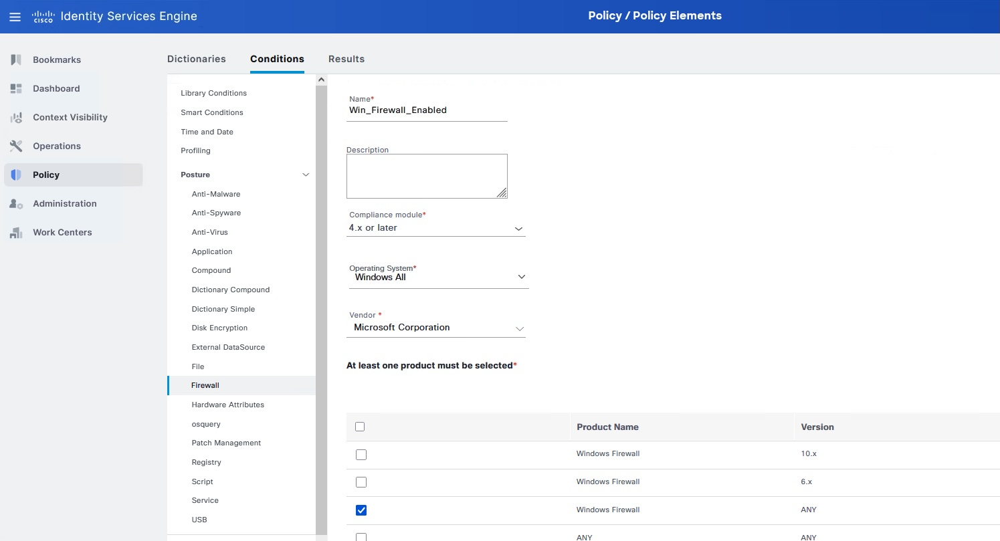

## Create Posture Requirement

A posture requirement groups one or more conditions and defines the remediation message shown to non-compliant users.

### Step 9. Navigate to Posture Requirements

Go to **Work Centers > Posture > Policy Elements > Requirements**. The page lists existing requirements with columns: Name, Operating System, Compliance Module, Posture Type, Conditions, and Remediations Actions.

To insert a new requirement, click the **Edit ∨** dropdown on any existing row and select **Insert new requirement**. A blank editable row appears.

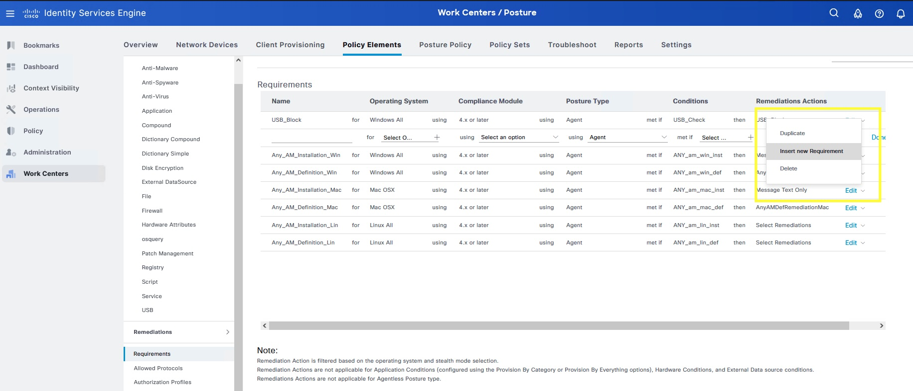

### Step 10. Define the Require_WinFirewall requirement

Fill in the new row:

- **Name**: `Require_WinFirewall`
- **Operating System**: Windows All
- **Compliance Module**: 4.x or later
- **Posture Type**: Agent
- **Conditions**: click **+** and select `Win_Firewall_Enabled` (created in Step 8)
- **Remediations Actions**: click **+**, select **Message Text Only**, and enter:

```
Windows Defender Firewall is disabled on your device.
To fix: Start > Settings > Privacy & Security > Windows Security >
Firewall & network protection > Domain network > toggle Firewall to On.
```

Click **Done** on the row, then click **Save** at the bottom of the page.

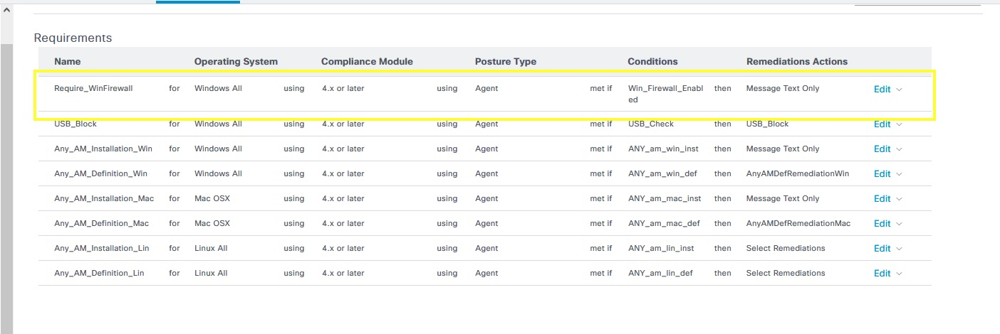

## Create Posture Policy

The posture policy maps endpoint criteria to requirements. Any Windows endpoint connecting via VPN will be evaluated against `Require_WinFirewall`.

### Step 11. Navigate to Posture Policy

Go to **Policy > Posture**. The page shows a default blank rule row. To insert a new rule, click the **Edit ∨** dropdown on the existing row and select **Insert new policy**. A new editable row appears.

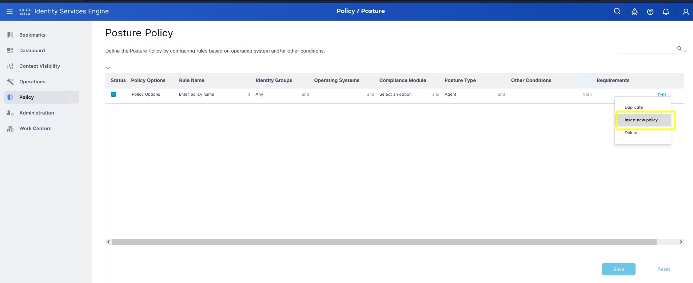

### Step 12. Create the VPN_Windows_Posture rule

Fill in the new row:

- **Rule Name**: `VPN_Windows_Posture`
- **Identity Groups**: Any
- **Operating Systems**: Windows All
- **Compliance Module**: 4.x or later
- **Posture Type**: Agent
- **Requirements**: click **+** and select `Require_WinFirewall` (created in Step 10)

Click **Done** on the row, then click **Save** at the bottom of the page.

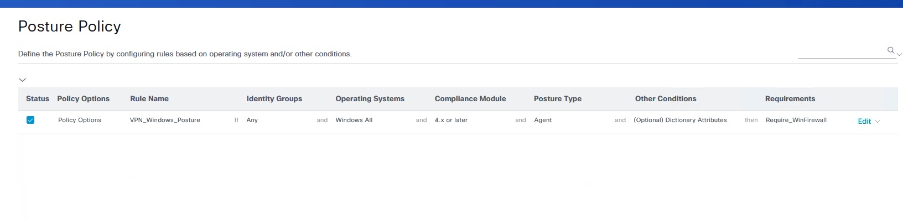

## Create Posture Authorization Profiles

Two new authorization profiles are needed alongside the existing ones: a redirect profile for unknown endpoints (while the agent initializes or the compliance module is being installed), and a monitor profile for non-compliant endpoints (full access with a visible profile name).

### Step 13. Create the Posture_Redirect_Authz authorization profile

Go to **Policy > Policy Elements > Results > Authorization > Authorization Profiles**. Click **+ Add**.

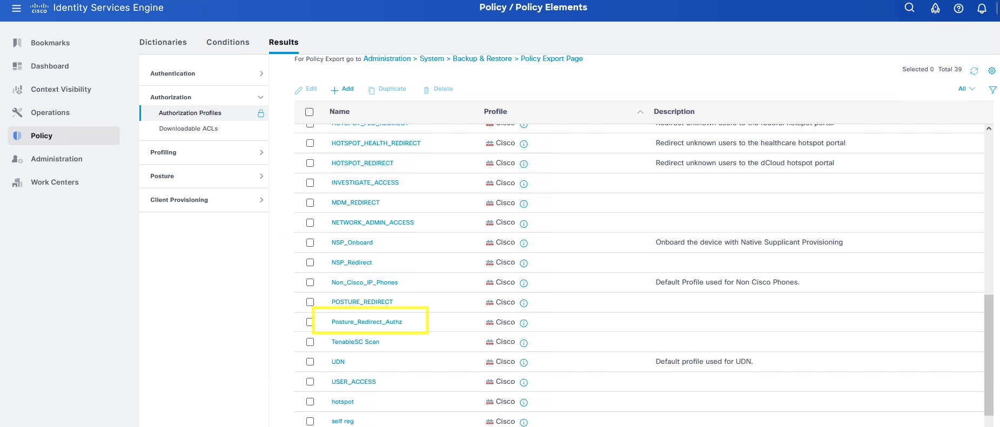

Fill in the top of the form:

- **Name**: `Posture_Redirect_Authz`
- **Access Type**: `ACCESS_ACCEPT`

Scroll down to **Common Tasks** and check **Web Redirection (CWA, MDM, NSP, CPP)**. Three fields appear beneath it:

- **Type**: Client Provisioning (Posture)
- **ACL**: `ACL_REDIRECT`
- **Value**: Client Provisioning Portal (default)

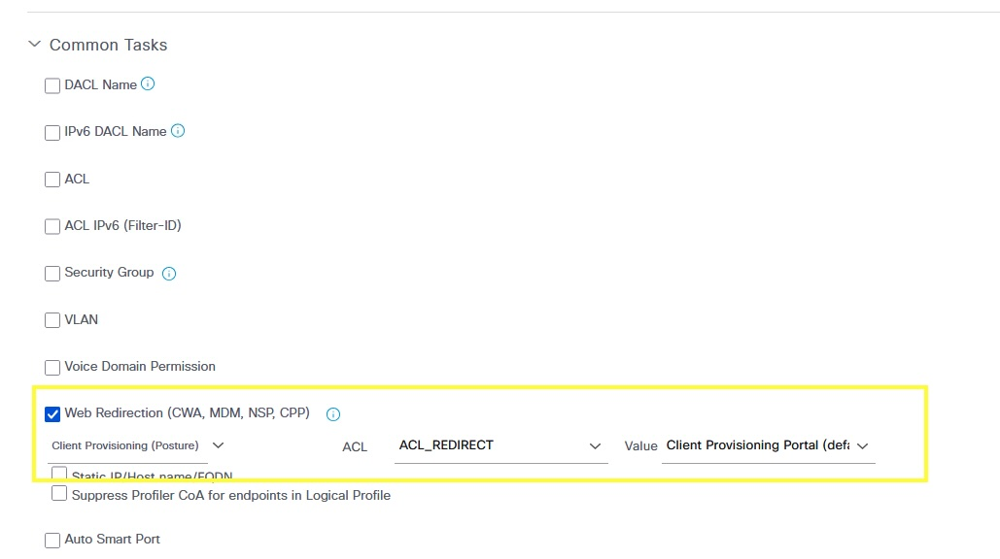

Click **Submit**.

**ACL_REDIRECT on the ASA:**

ISE pushes only the ACL *name* `ACL_REDIRECT` to the ASA via RADIUS — it does not push the ACL content itself. The ACL must already exist on the ASA before this profile is assigned.

To configure it, open **PuTTY** on the jump host, select the **ASAv** saved session entry, and click **Open**. Log in with `admin` / `C1sco12345`. Once logged in, enter privileged EXEC mode and then global configuration mode:

```
enable
config t
```

Then enter the following ACL commands:

```
access-list ACL_REDIRECT extended deny udp any any eq domain
access-list ACL_REDIRECT extended deny ip any host 198.18.133.27
access-list ACL_REDIRECT extended deny icmp any any
access-list ACL_REDIRECT extended permit tcp any any eq www
access-list ACL_REDIRECT extended permit tcp any any eq https
```

> **Guacamole copy-paste tip:** Standard Ctrl+V does not work inside a Guacamole terminal session. Use the Guacamole clipboard sidebar instead:
>
> | Step | Mac | Windows |
> |------|-----|---------|
> | Open sidebar | **Ctrl+Command+Shift** | **Ctrl+Alt+Shift** |
> | Paste text into the **Clipboard** box in the sidebar | same | same |
> | Close sidebar | **Ctrl+Command+Shift** | **Ctrl+Alt+Shift** |
> | Paste into terminal | **Right-click** | **Right-click** |
>
> Paste one line at a time to avoid the ASA misinterpreting rapid input.

Once entered, write the configuration to memory:

```
write memory
```

Verify it with:

```
show run | i ACL_REDIRECT
```

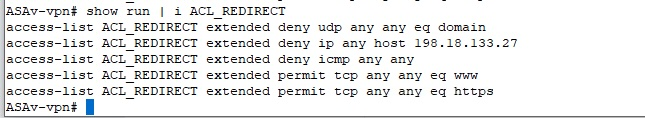

The redirect ACL logic is the **inverse** of a normal permit/deny ACL — `permit` means *redirect this traffic to the ISE portal*, `deny` means *let it pass through untouched*:

| Line | Effect |
|------|--------|
| `deny udp ... eq domain` | DNS passes through — the posture agent needs DNS to reach ISE |
| `deny ip any host 198.18.133.27` | All traffic to the ISE IP passes through on any port — covers the posture agent (8905), ISE portal (8443), and HTTPS (443) |
| `deny icmp any any` | ICMP passes through — avoids redirect loops |
| `permit tcp ... eq www` | HTTP browser traffic to any other host is redirected to the ISE portal |
| `permit tcp ... eq https` | HTTPS browser traffic to any other host is redirected to the ISE portal |

> Mental model: **pass everything destined for the ISE IP; redirect all other HTTP/HTTPS so the browser lands on the Client Provisioning Portal.**

### Step 14. Create the Posture_Monitor_PermitAll authorization profile

In Authorization Profiles, click **+ Add**. This profile is assigned to non-compliant users in Monitor Mode — it grants full access but uses a descriptive name that makes violations visible in logs without affecting the user.

- **Name**: `Posture_Monitor_PermitAll`
- **Access Type**: `ACCESS_ACCEPT`
- Under **Common Tasks**, check **DACL Name** → select `POV_dACL` (the `permit ip any any` dACL from Demo 3)

Click **Submit**.

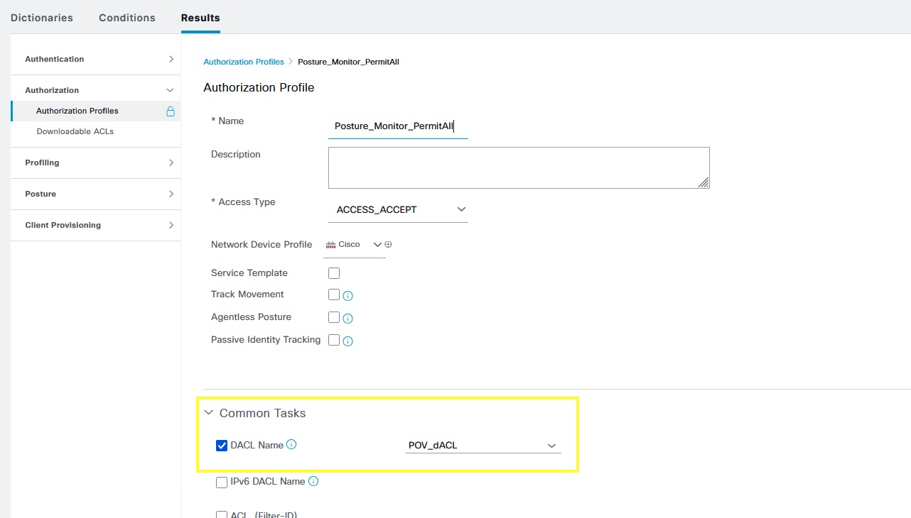

## Add Posture Rules to Authorization Policy

### Step 15. Open the Remote Access VPN policy set

Navigate to **Policy > Policy Sets** and open the **Remote Access VPN** policy set. Expand **Authorization Policy**.

Current rule order: POV Rules → QUARANTINE → Tier1 Users → Tier2 Users → Default.

Click the gear on the **POV Rules** row and select **Insert new rule above** three times to create three blank rows at the top. Name them (top to bottom):

1. `Posture_Compliant`
2. `Posture_NonCompliant`
3. `Posture_Unknown`

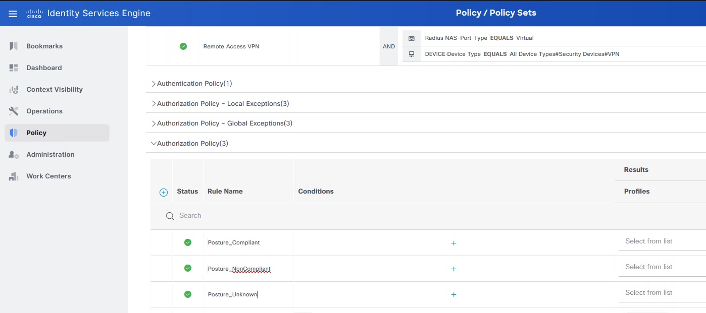

### Step 16. Configure the Posture_Unknown rule

Click **+** in the Conditions column for the `Posture_Unknown` row. In Conditions Studio:

- **Dictionary**: Session
- **Attribute**: PostureStatus
- **Value**: Unknown

Click **Use**. Set **Profiles** to `Posture_Redirect_Authz`.

> This rule handles two cases: endpoints where the compliance module is not yet installed (they will go through the CPP provisioning flow), and endpoints where the module is installed but the assessment is still in progress. Once ISE receives the posture result, it sends a CoA and the session moves to the Compliant or NonCompliant rule.

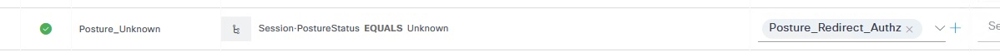

### Step 17. Configure the Posture_NonCompliant rule

Click **+** in the Conditions column for the `Posture_NonCompliant` row. In Conditions Studio:

- **Dictionary**: Session
- **Attribute**: PostureStatus
- **Value**: NonCompliant

Click **Use**. Set **Profiles** to `Posture_Monitor_PermitAll`.

This is the core of Monitor Mode — non-compliant users receive full access, but the profile name in logs immediately signals a violation to any administrator.

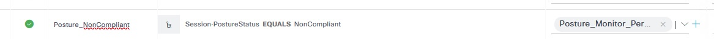

### Step 18. Configure the Posture_Compliant rule

Click **+** in the Conditions column for the `Posture_Compliant` row. In Conditions Studio:

- **Dictionary**: Session
- **Attribute**: PostureStatus
- **Value**: Compliant

Click **Use**. Set **Profiles** to **Tier1 Users** (full access). Click **Save**.

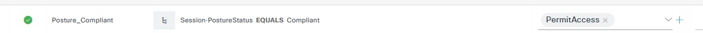

## Test: Simulate Non-Compliant Endpoint

### Step 19. Disable Windows Firewall on CESA4

On workstation **CESA4**, open **Start > Settings > Privacy & Security > Windows Security > Firewall & network protection**. Click **Domain network** and toggle **Microsoft Defender Firewall** to **Off**.

This simulates an endpoint that fails the `Win_Firewall_Enabled` posture check.

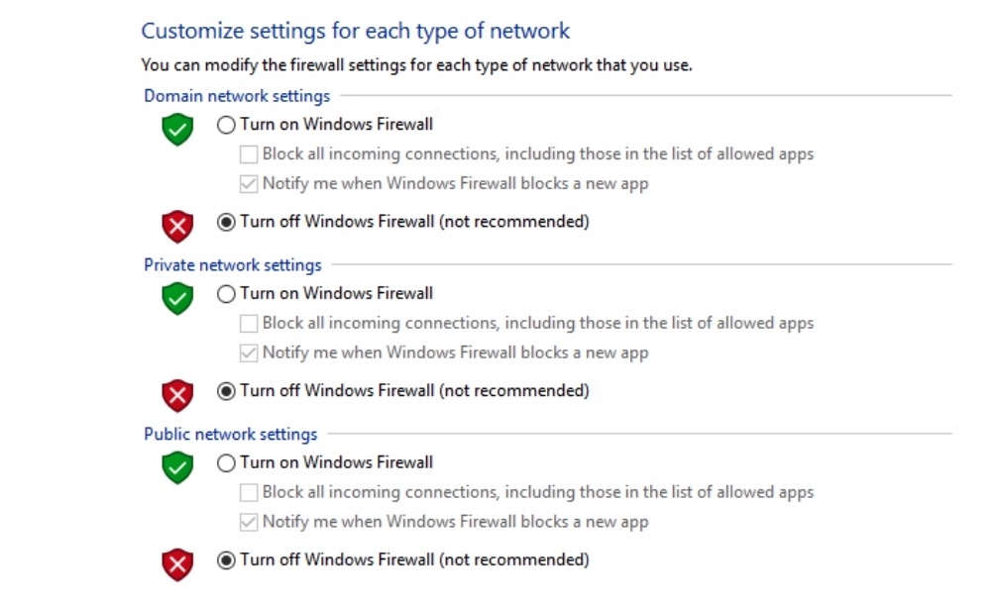

### Step 20. Connect VPN as employee and complete client provisioning

Open **Cisco Secure Client** on CESA4 and connect to `198.18.133.100`:

- **Username**: `employee`
- **Password**: `C1sco12345`

Once the VPN session establishes, ISE evaluates the session and finds `PostureStatus = Unknown` — the compliance module is not yet installed. The `Posture_Unknown` authorization rule matches and ISE pushes the `Posture_Redirect_Authz` profile, which redirects HTTP/HTTPS traffic to the Client Provisioning Portal. Open any website in the browser on CESA4 — the request is intercepted by the ASA and redirected to the ISE **Device Security Check** portal page.

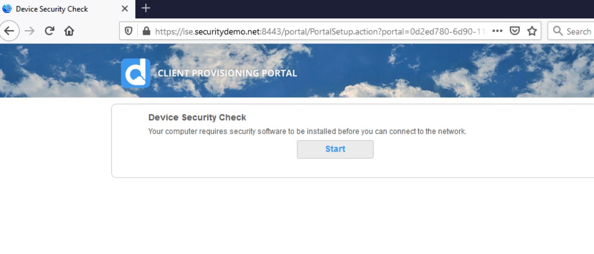

Click **Start**. The portal expands to the **This is my first time here** section, which provides step-by-step instructions and a **Click here to download and install Agent** link. The compliance module installs as an add-on alongside the existing Cisco Secure Client — no full reinstall is required.

> The portal displays a **4-minute countdown** timer. The compliance module must be downloaded, installed, and the posture check completed within this window. If the timer expires, the session is marked NonCompliant due to timeout.

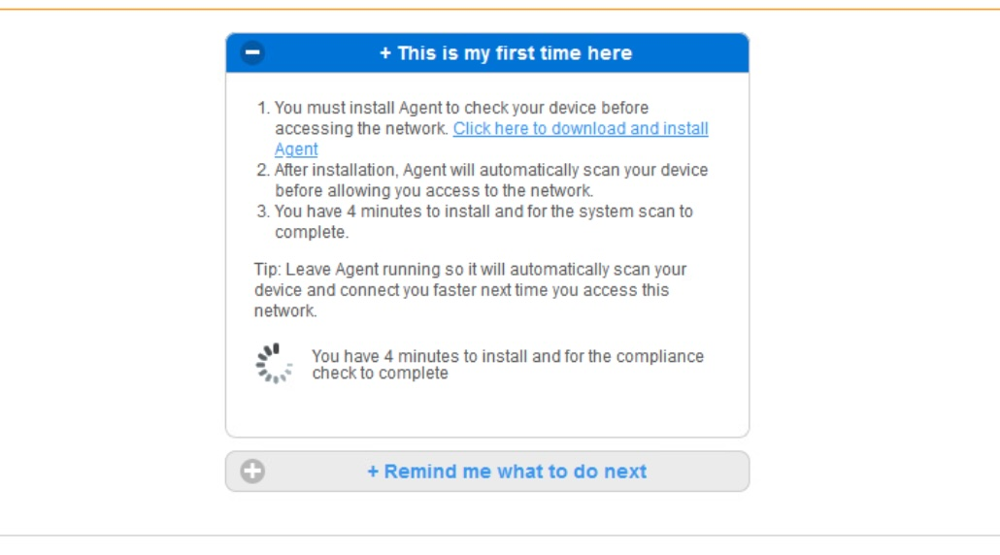

Once the module installs, it contacts ISE automatically and runs the posture assessment. ISE sends a CoA to the ASA and the session transitions from Unknown to Compliant or NonCompliant based on the firewall check result.


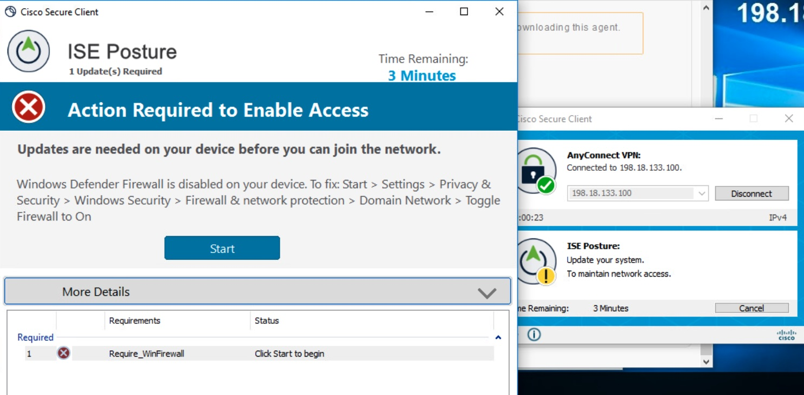


### Step 21. Observe non-compliant result — full access still granted

The ISE Posture module reports **Non-Compliant** (firewall is off). Because `Posture_NonCompliant` maps to `Posture_Monitor_PermitAll`, the user retains complete network access.

The Secure Client ISE Posture tile shows a warning icon, but the VPN session stays connected. The user can continue working normally.

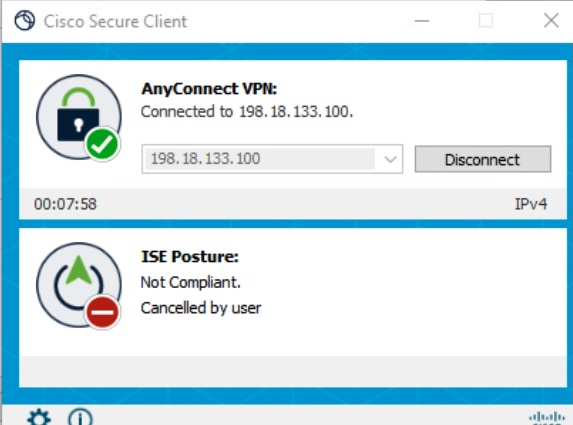

## Verify Posture Status in ISE Logs

### Step 22. Review RADIUS Live Logs

Navigate to **Operations > RADIUS > Live Logs**. Find the `employee` session and confirm:

- **Status**: Success (green — access was granted)
- **Authorization Policy**: `Remote Access VPN >> Posture_NonCompliant`
- **Authorization Profile**: `Posture_Monitor_PermitAll`

The profile name signals a compliance violation to any administrator scanning the logs, with no impact to the user.

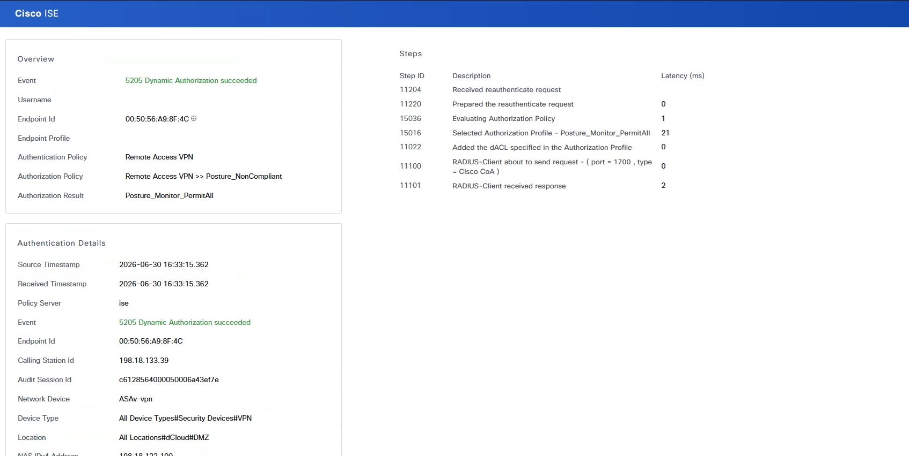

### Step 23. Review the Posture Assessment report

Navigate to **Operations > Reports > Endpoints and Users > Posture Assessment by Endpoint**. Locate the CESA4 entry:

- **Posture Status**: NonCompliant
- **Failure Reason**: `Win_Firewall_Enabled` — Windows Defender Firewall is not running
- **Assessment Time**: current timestamp

This report is the primary tool for identifying non-compliant endpoints during Monitor Mode and prioritizing remediation outreach before enforcement begins.

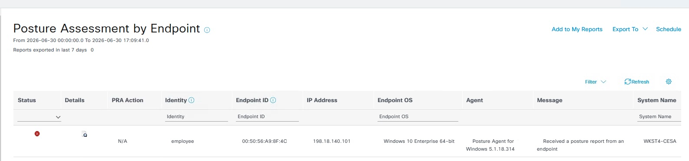

## Review Posture Policy Details

### Step 24. Inspect the failed condition in the Posture Report

Click the **CESA4** row in the Posture Assessment by Endpoint report to open the **Posture Report** detail page. Two sections are shown:

- **Posture Status**: NonCompliant, with the assessment timestamp
- **Posture Policy Details**: a table listing every policy evaluated against this endpoint

In the **Posture Policy Details** table, locate the row for `VPN_Windows_Posture`:

| Field | Value |
|-------|-------|
| Policy | `VPN_Windows_Posture` |
| Name | `Require_WinFirewall` |
| Enforcement Type | Mandatory |
| Status | Failed |
| Failed Conditions | `fw_enabled_v4_WindowsFirewall_ANY` |

The **Failed Conditions** column pinpoints exactly which check the endpoint did not pass. Use this detail to identify the specific remediation action needed — in this case, re-enabling Windows Defender Firewall — before communicating with the user or switching to enforcement mode.

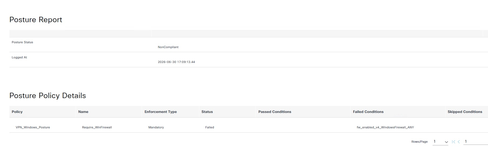

## Expected Outcome

By the end of this demo you should have confirmed:

- The ISE Compliance module is available in Client Provisioning Resources and will be served automatically to any Windows endpoint that connects via VPN without it.
- The full posture infrastructure (condition, requirement, policy, authorization profiles, and authorization rules) is in place and operational.
- Posture assessment runs automatically on every VPN session via the Cisco Secure Client ISE Posture module — whether the module was pre-installed or just provisioned by the CPP.
- Non-compliant endpoints are **identified and logged** without disrupting user access.
- RADIUS Live Logs surface compliance violations via the authorization profile name alone.
- The Posture Assessment by Endpoint report gives administrators a full view of endpoint health across the VPN population.
- The environment is ready for enforcement — covered in [Demo 5: ISE VPN Posture — Enforcement Mode](index5.md).

## Notes

- The three posture rules must sit **above** all identity-based rules (POV Rules, QUARANTINE, Tier1/Tier2) so posture status is evaluated first on every session.
- `ACL_REDIRECT` must be pre-configured on the ASA before assigning the `Posture_Redirect_Authz` profile. ISE pushes only the ACL name via RADIUS — not the ACL content.
- The Client Provisioning Portal requires the endpoint browser to trust the ISE certificate. In production, use a CA-signed cert on ISE to avoid browser warnings during the provisioning flow.
- The posture assessment grace period (how long ISE waits for the agent before treating the session as Unknown-timed-out) defaults to 3 minutes. Adjust under **Administration > Settings > Posture > General Settings**.
- Switching to enforcement later requires only **one authorization rule change** — the posture conditions, requirements, client provisioning, and policy are all untouched.

---

[← Demo 3: ISE POV Testing with dACL](index3.md) | [Next: ISE VPN Posture — Enforcement Mode →](index5.md)
