<script src="enrollment-gate.js" defer></script>

# ISE VPN Posture — Enforcement Mode

**Difficulty:** ★★★ Advanced

> **Prerequisite:** This demo continues from [Demo 4: ISE VPN Posture — Monitor Mode](index4.md). The posture infrastructure (condition, requirement, policy, and authorization rules) must already be in place before proceeding.
>
> **Scenario:** The security team has completed the Monitor Mode phase — non-compliant endpoints are identified and users have been briefed on the fix. It is now time to enforce. A single authorization rule change quarantines non-compliant devices to a restricted network segment. Users who fail posture land on an ISE remediation portal, fix the issue themselves, and regain full access automatically via ISE Change of Authorization — no help desk call required.

[← Demo 4: ISE VPN Posture — Monitor Mode](index4.md)

## Table of Contents

- [Objective](#objective)
- [Create Quarantine dACL and Authorization Profile](#create-quarantine-dacl-and-authorization-profile)
- [Switch to Enforcement Mode](#switch-to-enforcement-mode)
- [Test: Non-Compliant User Is Quarantined](#test-non-compliant-user-is-quarantined)
- [User Self-Remediates](#user-self-remediates)
- [ISE CoA Restores Full Access](#ise-coa-restores-full-access)
- [Verify Full Access Restored](#verify-full-access-restored)
- [Expected Outcome](#expected-outcome)
- [Notes](#notes)

## Objective

Demonstrate enforcement mode and the self-remediation workflow:

- A **quarantine dACL** restricts non-compliant users to DNS and the ISE remediation portal only — all corporate resources are unreachable.
- A **Posture_Quarantine** authorization profile wraps the dACL and adds a browser redirect to the ISE portal so users see remediation instructions immediately.
- Switching from Monitor Mode to Enforcement Mode is a **single rule change** — no posture infrastructure changes are needed.
- After the user fixes the issue and triggers a re-scan, ISE sends a **CoA** to the ASA. The VPN session is updated in place — the user is never disconnected.

## Create Quarantine dACL and Authorization Profile

### Step 1. Create the Posture_Quarantine_dACL

Navigate to **Policy > Policy Elements > Results > Authorization > Downloadable ACLs**. Click **+ Add**.

Configure:

- **Name**: `Posture_Quarantine_dACL`
- **IP version**: IPv4
- **DACL Content**:

```
permit udp any any eq 53
permit tcp any host 198.18.133.27 eq 443
permit tcp any host 198.18.133.27 eq 8443
deny   ip  any any
```

| Line | Effect |
|------|--------|
| `permit udp ... eq 53` | DNS — the endpoint must be able to resolve hostnames to reach the ISE portal |
| `permit tcp any host 198.18.133.27 eq 443` | HTTPS to the ISE PSN — covers the remediation portal and posture agent traffic |
| `permit tcp any host 198.18.133.27 eq 8443` | ISE Guest/Posture portal — the remediation landing page the user sees in their browser |
| `deny ip any any` | All other traffic is blocked — corporate resources are unreachable until the device passes posture |

> Replace `198.18.133.27` with your ISE PSN IP. In production, use the VIP if ISE is load-balanced.

Click **Submit**.

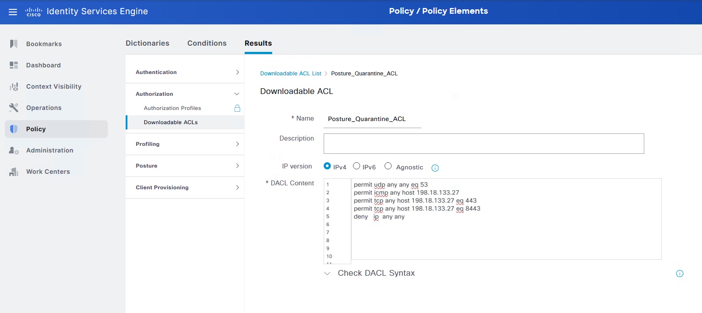

### Step 2. Create the Posture_Quarantine authorization profile

Navigate to **Policy > Policy Elements > Results > Authorization > Authorization Profiles**. Click **+ Add**.

Configure:

- **Name**: `Posture_Quarantine`
- **Access Type**: `ACCESS_ACCEPT`
- Under **Common Tasks**, check **DACL Name** → select `Posture_Quarantine_dACL`
- Under **Common Tasks**, check **Web Redirection**:
  - **Type**: Centralized Web Auth
  - **ACL**: `ACL_REDIRECT`
  - **Value**: My Devices Portal (or a custom remediation page)

Click **Submit**.

The combined effect: the endpoint gets network access only to DNS and the ISE portal, and the browser is immediately redirected to the remediation landing page.

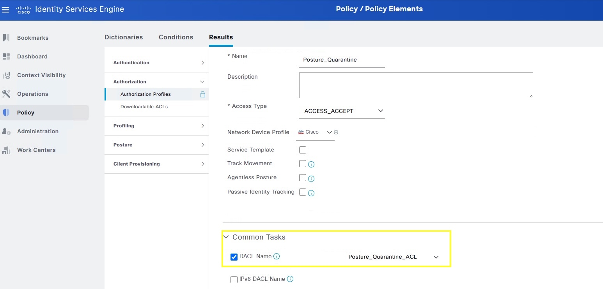

## Switch to Enforcement Mode

### Step 3. Change the Posture_NonCompliant rule to use Posture_Quarantine

Navigate to **Policy > Policy Sets > Remote Access VPN > Authorization Policy**.

On the `Posture_NonCompliant` row, change the **Profiles** assignment from `Posture_Monitor_PermitAll` to `Posture_Quarantine`. Click **Save**.

This is the only change needed to move from Monitor Mode to Enforcement Mode. All posture conditions, requirements, and policy rules are unchanged.

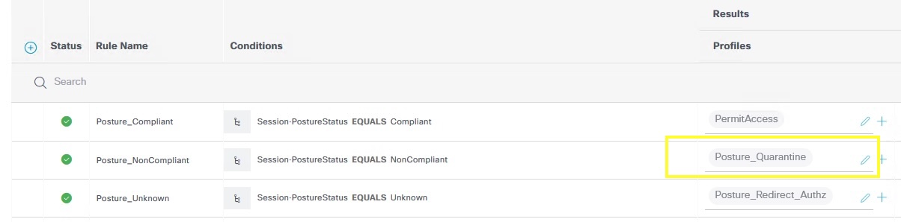

## Test: Non-Compliant User Is Quarantined

### Step 4. Confirm Windows Firewall is still off and reconnect VPN

Verify that Windows Firewall is still disabled on **CESA4** (from Demo 4 Step 17). Disconnect and reconnect the VPN session as `employee` / `C1sco12345`.

The ISE Posture module runs, detects the firewall is off, and reports **Non-Compliant**. ISE now applies `Posture_Quarantine` instead of the permit-all profile.

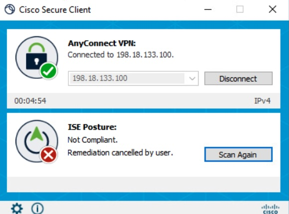

### Step 5. Confirm corporate resources are blocked — remediation portal is reachable

Open a browser on CESA4 and attempt to navigate to `corporate-records.dcloud.cisco.com`. The site does not load — the quarantine dACL blocks all non-ISE traffic.

The browser is automatically redirected to the ISE portal at `https://198.18.133.27:8443/portal/...`, displaying the remediation instructions configured in Demo 4 Step 8.

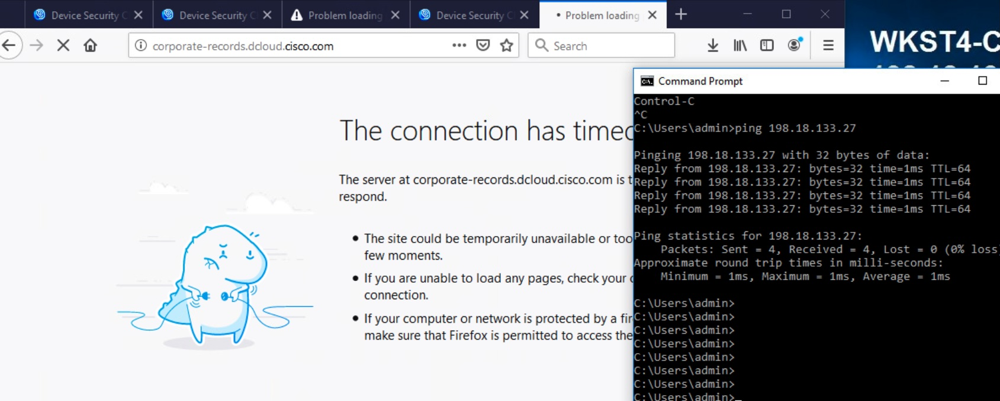

### Step 6. Verify quarantine in ISE Live Logs

Navigate to **Operations > RADIUS > Live Logs**. The `employee` session now shows:

- **Status**: Success (an Access-Accept was returned — but with the restricted dACL)
- **Authorization Policy**: `Remote Access VPN >> Posture_NonCompliant`
- **Authorization Profile**: `Posture_Quarantine`

The endpoint is on the network but restricted to DNS and the ISE portal only.

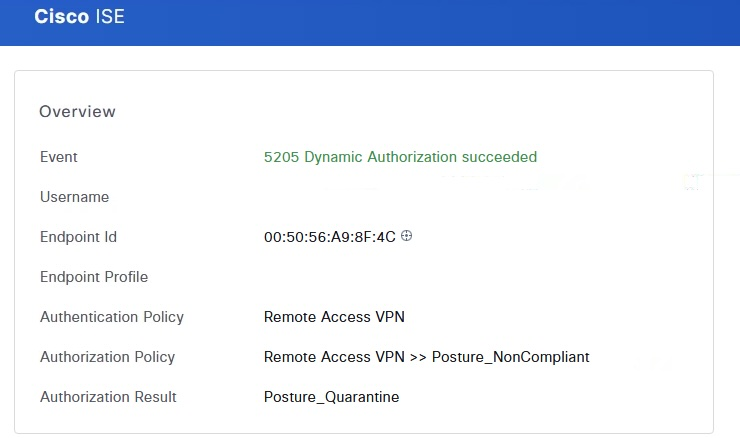

## User Self-Remediates

### Step 7. Enable Windows Firewall on CESA4

On CESA4, follow the instructions shown in the browser: navigate to **Start > Settings > Privacy & Security > Windows Security > Firewall & network protection**. Click **Domain network** and toggle **Microsoft Defender Firewall** back to **On**.

No help desk call is needed. The user resolved the issue using the instructions served directly by the ISE remediation portal.

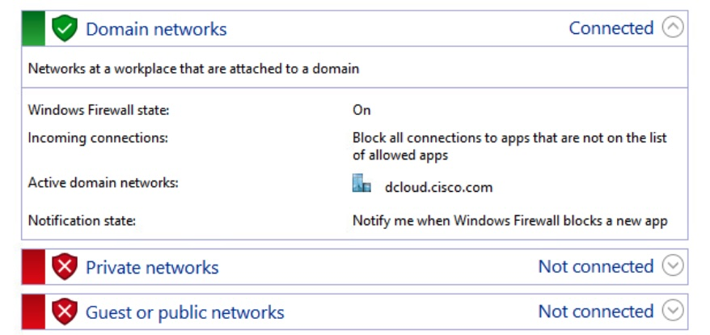

### Step 8. Trigger posture re-assessment from Cisco Secure Client

In Cisco Secure Client, click the **ISE Posture** tile and select **Scan Again**. The posture module re-checks all conditions against the current endpoint state.

> The re-assessment also runs automatically after the configured timer (default 5 minutes). **Scan Again** lets you demonstrate the result immediately without waiting.

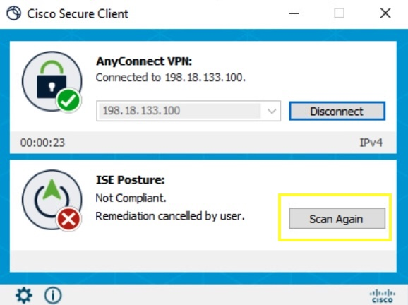

## ISE CoA Restores Full Access

### Step 9. Observe the CoA event in ISE Live Logs

When the posture module reports **Compliant**, ISE immediately sends a **Change of Authorization (CoA)** RADIUS packet to the ASA. The ASA re-evaluates the session and applies the updated authorization result without dropping the tunnel.

Navigate to **Operations > RADIUS > Live Logs**. A new event appears for `employee`:

- **Authorization Policy**: `Remote Access VPN >> Posture_Compliant`
- **Authorization Profile**: `Tier1 Users`

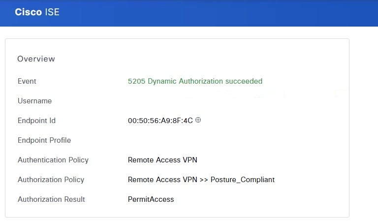

### Step 10. Confirm Cisco Secure Client posture status is Compliant

On CESA4, the Cisco Secure Client ISE Posture tile updates to **Compliant** with a green checkmark. The VPN session has been active throughout the entire remediation cycle — no reconnect was required.

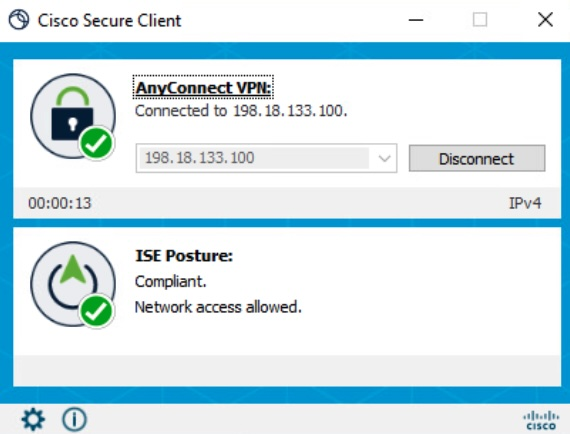

## Verify Full Access Restored

### Step 11. Confirm corporate resources are accessible

On CESA4, open a browser and navigate to `corporate-records.dcloud.cisco.com`. The page loads successfully — the quarantine dACL has been removed and full access is restored.

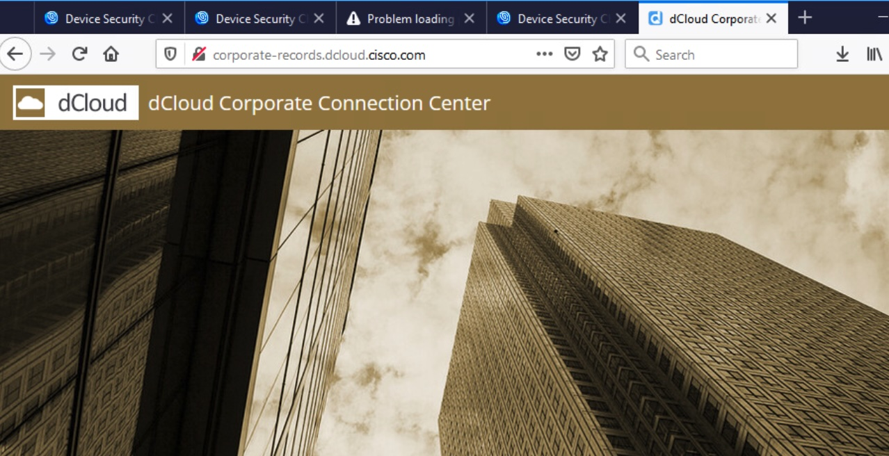

### Step 12. Review the full remediation audit trail

Navigate to **Operations > Reports > Endpoints and Users > Posture Assessment by Endpoint**. CESA4 now shows two entries:

1. The earlier **NonCompliant** assessment (from the failed firewall check)
2. The current **Compliant** assessment (after the user fixed it)

Each entry has a timestamp, giving a complete record of the detection and remediation cycle — without any manual intervention beyond the user enabling their firewall.

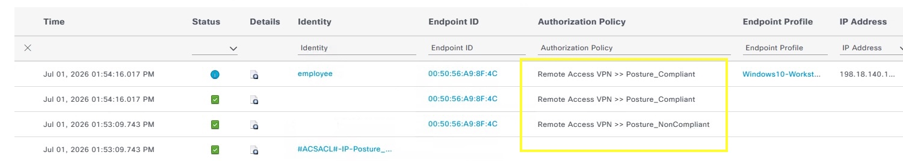

## Expected Outcome

By the end of this demo you should have confirmed:

- Switching from Monitor Mode to Enforcement Mode required **one rule change** — the posture infrastructure built in Demo 4 was unchanged.
- Non-compliant users land in a **quarantine authorization profile** that blocks all corporate traffic while allowing access only to DNS and the ISE remediation portal.
- The browser redirect surfaces fix instructions to the user **immediately** — no help desk call, no ticket, no manual intervention.
- After remediation, ISE sends a **CoA** to the ASA and the session is updated in place. The user regains full access without reconnecting.
- The Posture Assessment report provides a timestamped audit trail of every compliance state change across the VPN population.

## Notes

- CoA requires the ISE PSN to be configured as a RADIUS server with dynamic authorization enabled on the ASA. Verify with `show running-config | include dynamic-authori` on the ASA before testing.
- The quarantine dACL permits traffic to the ISE PSN IP directly. If your ISE node is behind a load balancer, permit traffic to the VIP — not an individual node IP — to avoid session-stickiness issues.
- To roll back to Monitor Mode at any time: change the `Posture_NonCompliant` rule profile back to `Posture_Monitor_PermitAll`. No other changes are needed.
- For production, consider adding automatic remediation actions to the posture requirement (e.g., auto-enable Windows Firewall). This removes user action entirely for simple fixes and reduces portal load.
- The posture re-assessment timer defaults to 5 minutes. Adjust under **Administration > Settings > Posture > General Settings** if a shorter feedback loop is needed for the demo.

---

[← Demo 4: ISE VPN Posture — Monitor Mode](index4.md)
